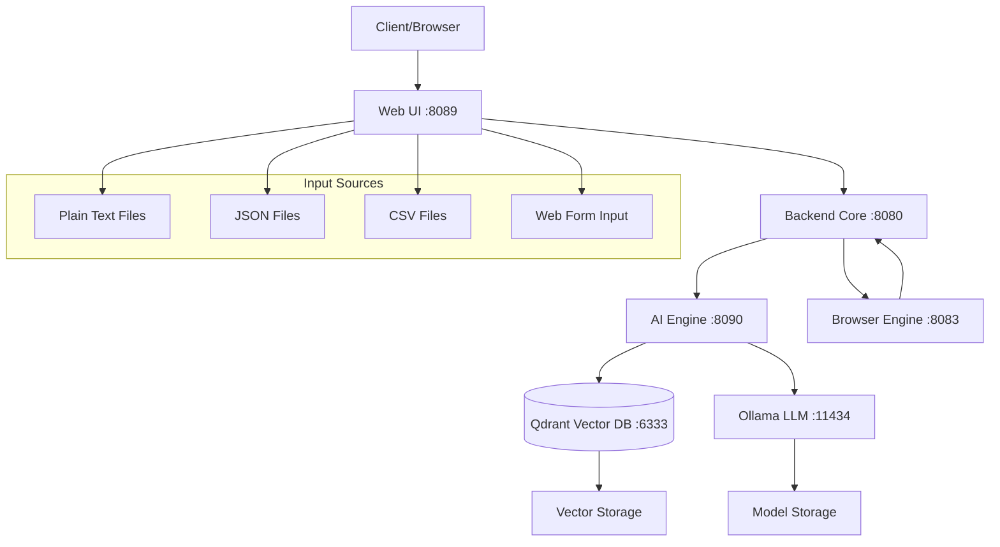
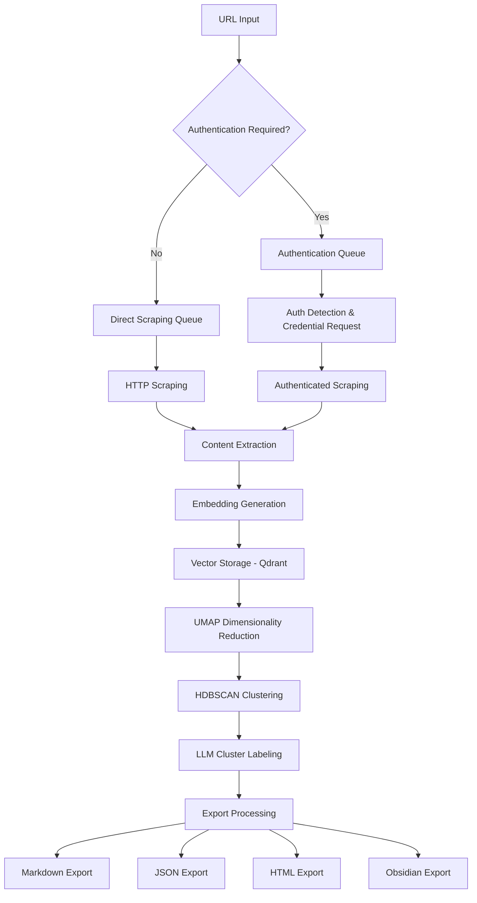
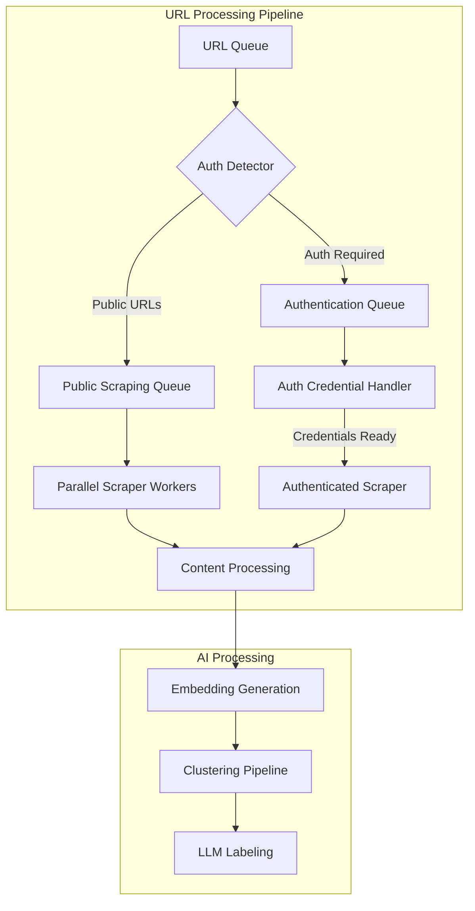
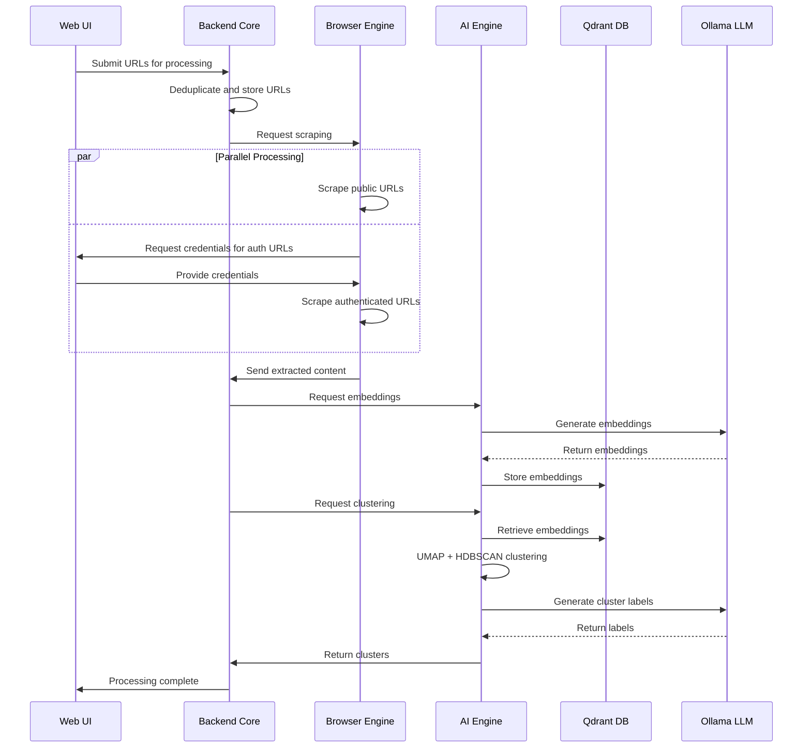
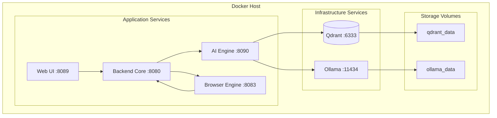
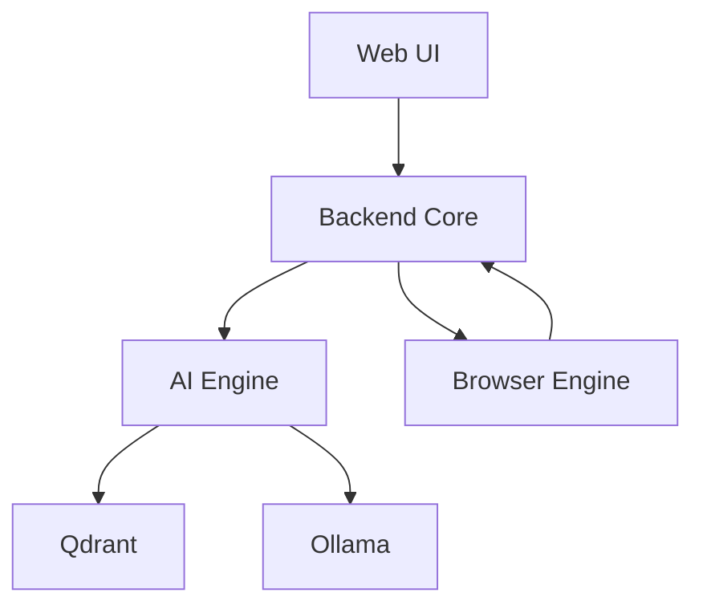

# Architecture Documentation

## Table of Contents
1. [System Overview](#system-overview)
2. [High-Level Architecture](#high-level-architecture)
3. [Core Services](#core-services)
4. [Data Flow](#data-flow)
5. [Technology Stack](#technology-stack)
6. [Container Architecture](#container-architecture)
7. [API Specification](#api-specification)
8. [Security Architecture](#security-architecture)
9. [Performance & Scalability](#performance--scalability)
10. [Deployment Architecture](#deployment-architecture)

## System Overview

The Tab Organizer is a microservice-based system that processes web content through a pipeline of specialized services. The architecture emphasizes local AI processing, privacy, and scalability while maintaining simplicity in deployment through Docker containerization. The system operates with optional offline capability and supports multiple export formats including Markdown, JSON, HTML, and Obsidian.

### Key Architectural Principles
- **Microservice Architecture**: 4 core services with clear separation of concerns
- **Multi-Provider AI**: Support for local (Ollama) and cloud AI providers (OpenAI, Anthropic, DeepSeek, Gemini)
- **Parallel Processing**: Non-blocking authentication and scraping workflows
- **Container-First Design**: All development, testing, and deployment in Docker
- **Event-Driven Communication**: Asynchronous processing with proper orchestration

## High-Level Architecture



### Data Pipeline Flow



### Parallel Processing Architecture



### Service Communication Diagram



## Core Services

### 1. Backend Core (Port 8080)
**Purpose**: API Gateway, session management, and URL storage

**Responsibilities**:
- Session lifecycle management
- URL deduplication and storage
- Export functionality (Markdown, JSON, HTML, Obsidian)
- Orchestration of scraping and clustering workflows
- Health monitoring

**Key Components**:
- `app/api/routes.py` - FastAPI routes
- `app/url_input/store.py` - URL storage with deduplication
- `app/url_input/dedup.py` - URL normalization and deduplication
- `app/sessions/manager.py` - Session management
- `app/export/exporter.py` - Multi-format export

**Technology**: FastAPI, Python 3.11

### 2. AI Engine (Port 8090)
**Purpose**: AI services for embeddings, clustering, and chatbot

**Responsibilities**:
- Multi-provider LLM support (Ollama, OpenAI, Anthropic, DeepSeek, Gemini)
- Embedding generation with configurable models
- UMAP + HDBSCAN clustering pipeline
- RAG-based chatbot with Qdrant vector search
- Dynamic provider switching

**Key Components**:
- `app/core/llm_client.py` - Unified LLM client
- `app/providers/` - Provider implementations
- `app/clustering/pipeline.py` - Clustering pipeline
- `app/chatbot/rag.py` - RAG chatbot

**Technology**: FastAPI, UMAP, HDBSCAN, Qdrant client, Python 3.11

### 3. Browser Engine (Port 8083)
**Purpose**: Web scraping and authentication handling

**Responsibilities**:
- HTTP-based content scraping
- Authentication detection and credential management
- Parallel processing of public and authenticated URLs
- Content extraction and cleaning
- Robots.txt compliance

**Key Components**:
- `app/scraper/engine.py` - Scraping engine
- `app/auth/detector.py` - Authentication detection
- `app/auth/queue.py` - Authentication queue management
- `app/extraction/` - Content extraction utilities

**Technology**: FastAPI, httpx, BeautifulSoup, trafilatura, Python 3.11

### 4. Web UI (Port 8089)
**Purpose**: Streamlit-based user interface

**Responsibilities**:
- URL input and management
- Scraping progress monitoring
- Clustering visualization
- RAG chatbot interface
- Export and settings management

**Key Components**:
- `src/pages/url_input.py` - URL input page
- `src/pages/scraping.py` - Scraping page
- `src/pages/clustering.py` - Clustering page
- `src/pages/chatbot.py` - Chatbot page
- `src/pages/settings.py` - Settings page
- `src/api/client.py` - Backend API client

**Technology**: Streamlit, Python 3.11

## Container Network Architecture



## Data Flow

### Primary Workflow
1. **Input**: URLs added via web UI (paste, upload file)
2. **Deduplication**: URL normalization and duplicate detection
3. **Authentication**: Automatic detection and credential request
4. **Scraping**: Parallel content extraction (public + authenticated)
5. **Analysis**: AI-powered embedding generation
6. **Clustering**: UMAP + HDBSCAN with LLM-generated labels
7. **Export**: Multi-format output (Markdown, JSON, HTML, Obsidian)

### Session Management
1. **Creation**: New session with unique ID
2. **URL Storage**: Deduplicated URL collection
3. **Processing**: Scraping and clustering workflows
4. **Persistence**: Session data stored in Qdrant collections
5. **Export**: Session data exported in various formats

## Technology Stack

### Core Infrastructure
- **Containerization**: Docker & Docker Compose
- **API Framework**: FastAPI (Python 3.11)
- **Vector Database**: Qdrant
- **AI Models**: Ollama (local) or cloud providers

### AI & Machine Learning
- **LLM Providers**: Ollama, OpenAI, Anthropic Claude, DeepSeek, Google Gemini
- **Embedding Models**: nomic-embed-text, all-minilm, mxbai-embed-large
- **Clustering**: UMAP + HDBSCAN
- **Content Processing**: BeautifulSoup, trafilatura

### Data Processing
- **Web Scraping**: httpx, BeautifulSoup
- **Authentication**: Credential detection and management
- **File Processing**: CSV, JSON, text file parsing

### Export & Integration
- **Template Engine**: Jinja2
- **Export Formats**: Markdown, JSON, HTML, Obsidian
- **Vector Search**: Qdrant for RAG chatbot

## Security Considerations

### Credential Management
- Encrypted credential storage
- Domain-specific credential isolation
- Secure error handling without credential exposure

### Network Security
- Internal Docker network isolation
- Service-to-service communication within Docker network
- Health check endpoints for monitoring
- No external API calls for local mode

### Data Privacy
- Optional local processing (Ollama mode)
- Persistent local storage
- Session-based data isolation
- Configurable data retention

## Scalability & Performance

### Horizontal Scaling
- Microservice architecture enables independent scaling
- Docker Compose profiles for different deployment scenarios
- Stateless services (except Qdrant and Ollama)

### Resource Optimization
- Configurable AI provider selection
- Dynamic model switching
- Parallel scraping with configurable concurrency
- Efficient vector storage with Qdrant

### Performance Monitoring
- Health check endpoints on all services
- Service status monitoring
- Resource usage tracking

## API Specification

### Backend Core (Port 8080)

| Endpoint | Method | Description |
|----------|--------|-------------|
| `/api/v1/sessions` | POST | Create new session |
| `/api/v1/sessions` | GET | List all sessions |
| `/api/v1/sessions/{id}` | GET | Get session details |
| `/api/v1/urls` | POST | Add URLs to session |
| `/api/v1/urls/{session_id}` | GET | Get session URLs |
| `/api/v1/scrape` | POST | Start scraping |
| `/api/v1/scrape/status/{session_id}` | GET | Get scrape status |
| `/api/v1/cluster` | POST | Start clustering |
| `/api/v1/export` | POST | Export session |
| `/health` | GET | Health check |

### AI Engine (Port 8090)

| Endpoint | Method | Description |
|----------|--------|-------------|
| `/embed` | POST | Generate embeddings |
| `/cluster` | POST | Cluster URLs |
| `/chat` | POST | Chat with content |
| `/search` | POST | Search content |
| `/index` | POST | Index documents |
| `/providers` | GET | Get provider info |
| `/providers/switch` | POST | Switch providers |
| `/health` | GET | Health check |

### Browser Engine (Port 8083)

| Endpoint | Method | Description |
|----------|--------|-------------|
| `/scrape` | POST | Start batch scraping |
| `/scrape/single` | POST | Scrape single URL |
| `/scrape/status/{session_id}` | GET | Get scrape status |
| `/auth/pending` | GET | Get pending auth requests |
| `/auth/credentials` | POST | Submit credentials |
| `/health` | GET | Health check |

## Deployment Architecture

### Development Environment
- Single-machine Docker Compose deployment
- Local model storage and vector database
- Hot reloading for all services
- Containerized testing environment

### Production Considerations
- Persistent volume management
- Backup and disaster recovery
- Monitoring and alerting
- CI/CD pipeline integration
- Model update procedures
- Horizontal scaling for high load

### Container Orchestration
```yaml
version: '3.8'
services:
  # Infrastructure
  qdrant:
    image: qdrant/qdrant:latest
    ports: ["6333:6333"]
    volumes: [qdrant_data:/qdrant/storage]
    
  ollama:
    image: ollama/ollama:latest
    ports: ["11434:11434"]
    volumes: [ollama_data:/root/.ollama]
    
  # Application Services
  backend-core:
    build: ./services/backend-core
    ports: ["8080:8080"]
    depends_on: [qdrant, ai-engine, browser-engine]
    
  ai-engine:
    build: ./services/ai-engine
    ports: ["8090:8090"]
    depends_on: [qdrant, ollama]
    
  browser-engine:
    build: ./services/browser-engine
    ports: ["8083:8083"]
    
  web-ui:
    build: ./services/web-ui
    ports: ["8089:8089"]
    depends_on: [backend-core]
    
volumes:
  qdrant_data:
  ollama_data:
```

## Service Dependencies



### Startup Order
1. Qdrant (vector database)
2. Ollama (LLM server)
3. AI Engine (depends on Qdrant, Ollama)
4. Browser Engine (independent)
5. Backend Core (depends on AI Engine, Browser Engine)
6. Web UI (depends on Backend Core)

### Health Checks
All services expose `/health` endpoints for monitoring:
- Backend Core: `http://localhost:8080/health`
- AI Engine: `http://localhost:8090/health`
- Browser Engine: `http://localhost:8083/health`
- Qdrant: `http://localhost:6333/`
- Ollama: `http://localhost:11434/`
