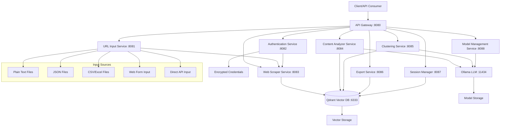

# Architecture Documentation

## System Overview

The Web Scraping, Analysis & Clustering Tool is a microservice-based system that processes web content through a pipeline of specialized services. The architecture emphasizes local AI processing, privacy, and scalability while maintaining simplicity in deployment through Docker containerization.

## High-Level Architecture

## Core Services

### 1. API Gateway (Port 8080)
- **Purpose**: Central orchestration and routing
- **Features**: 
  - Request routing to appropriate services
  - Health monitoring and circuit breakers
  - Job queue management for long-running operations
  - Model-aware load balancing
  - Comprehensive logging with correlation IDs

### 2. URL Input Service (Port 8081)
- **Purpose**: Multi-format URL parsing and validation
- **Features**:
  - File upload support (text, JSON, CSV, Excel)
  - URL validation and format detection
  - Metadata extraction and enrichment
  - Batch processing for large URL lists
  - Preview functionality

### 3. Authentication Service (Port 8082)
- **Purpose**: Secure credential management and authentication
- **Features**:
  - Automatic authentication requirement detection
  - AES-256 encrypted credential storage
  - Popup-based interactive authentication
  - OAuth 2.0 flow handlers
  - Session persistence and renewal
  - Domain authentication mapping

### 4. Web Scraper Service (Port 8083)
- **Purpose**: Content extraction with authentication support
- **Features**:
  - Scrapy-based framework with rate limiting
  - Content extraction using Beautiful Soup and trafilatura
  - Duplicate detection using content hashing
  - Robots.txt compliance
  - Authentication integration
  - Parallel processing of public/authenticated URLs

### 5. Content Analyzer Service (Port 8084)
- **Purpose**: AI-powered content analysis and embedding generation
- **Features**:
  - Configurable embedding models (nomic-embed-text, all-minilm, mxbai-embed-large)
  - Dynamic model selection and switching
  - Text chunking with overlap preservation
  - Keyword extraction and quality assessment
  - Model-specific caching and optimization
  - Hardware-aware model recommendations

### 6. Clustering Service (Port 8085)
- **Purpose**: Intelligent content clustering with visualization
- **Features**:
  - UMAP dimensionality reduction with model-aware optimization
  - HDBSCAN density-based clustering
  - Automatic parameter tuning based on embedding characteristics
  - Cluster quality metrics and stability tracking
  - LLM-powered cluster labeling and summaries
  - Visualization generation (2D/3D plots)

### 7. Export Service (Port 8086)
- **Purpose**: Multi-platform export with customizable formats
- **Features**:
  - Template-based export system using Jinja2
  - Notion API integration
  - Obsidian markdown with internal linking
  - Word document generation
  - Standard markdown with frontmatter
  - Batch export processing

### 8. Session Management Service (Port 8087)
- **Purpose**: Session-based data organization and persistence
- **Features**:
  - Model-aware Qdrant collection management
  - Session metadata tracking with model usage history
  - Incremental clustering for new content
  - Session comparison and evolution tracking
  - Backup/restore with model configurations
  - Data archival and cleanup

### 9. Model Management Service (Port 8088)
- **Purpose**: Advanced AI model lifecycle management
- **Features**:
  - Hardware detection and model recommendations
  - Dynamic model downloading and installation
  - Intelligent fallback chains for resource constraints
  - Hot model switching without service restart
  - Performance monitoring and resource tracking
  - Task-specific model optimization
  - Automatic cleanup and storage optimization

## Data Flow

### Primary Workflow
1. **Input**: URLs uploaded via various formats (text, JSON, CSV, Excel)
2. **Validation**: URL parsing, validation, and enrichment
3. **Authentication**: Automatic detection and credential management
4. **Scraping**: Content extraction with authentication support
5. **Analysis**: AI-powered content analysis and embedding generation
6. **Clustering**: Intelligent grouping with LLM-generated labels
7. **Export**: Multi-format output (Notion, Obsidian, Word, Markdown)

### Model Management Flow
1. **Detection**: Hardware capabilities and resource constraints
2. **Recommendation**: Task-specific and performance-optimized model selection
3. **Installation**: Dynamic downloading with validation
4. **Optimization**: Performance monitoring and automatic tuning
5. **Fallback**: Intelligent model switching on failures
6. **Cleanup**: Usage-based retention and storage optimization

## Technology Stack

### Core Infrastructure
- **Containerization**: Docker & Docker Compose
- **API Framework**: FastAPI (Python)
- **Vector Database**: Qdrant
- **AI Models**: Ollama (local LLM hosting)

### AI & Machine Learning
- **LLM Models**: Qwen3, Phi4, Gemma3, Llama3.2, Mistral, CodeLlama
- **Embedding Models**: nomic-embed-text, all-minilm, mxbai-embed-large
- **Clustering**: UMAP + HDBSCAN
- **Content Processing**: Beautiful Soup, trafilatura

### Data Processing
- **Web Scraping**: Scrapy framework
- **File Processing**: pandas, openpyxl
- **Authentication**: Selenium/Playwright for popup handling
- **Encryption**: AES-256 for credential storage

### Export & Integration
- **Template Engine**: Jinja2
- **Document Generation**: python-docx
- **API Integration**: Notion API
- **Markdown Processing**: Standard markdown with frontmatter

## Security Considerations

### Credential Management
- AES-256 encryption for stored credentials
- Master key-based encryption system
- Secure error handling without credential exposure
- Domain-specific credential isolation

### Network Security
- Internal Docker network isolation
- Service-to-service authentication
- Health check endpoints for monitoring
- Structured logging without sensitive data

### Data Privacy
- Local processing (no external API calls)
- Persistent local storage
- Session-based data isolation
- Configurable data retention policies

## Scalability & Performance

### Horizontal Scaling
- Microservice architecture enables independent scaling
- Docker Compose profiles for different deployment scenarios
- Load balancing through API Gateway

### Resource Optimization
- Hardware-aware model selection
- Dynamic model switching based on resource constraints
- Intelligent caching strategies
- Memory management and garbage collection

### Performance Monitoring
- Comprehensive metrics collection
- Model performance tracking
- Resource usage monitoring
- Automatic optimization recommendations

## Deployment Architecture

### Development Environment
- Single-machine Docker Compose deployment
- Local model storage and vector database
- Development-optimized model configurations

### Production Considerations
- Persistent volume management
- Backup and disaster recovery procedures
- Monitoring and alerting systems
- CI/CD pipeline integration
- Model update and migration procedures