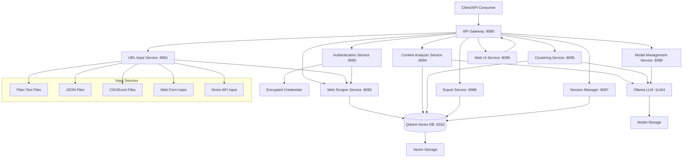
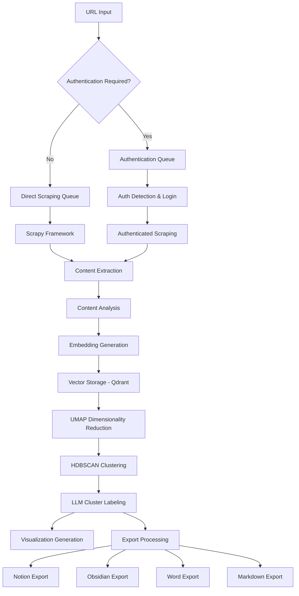
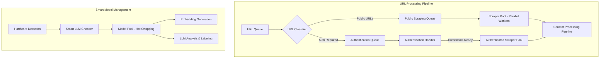
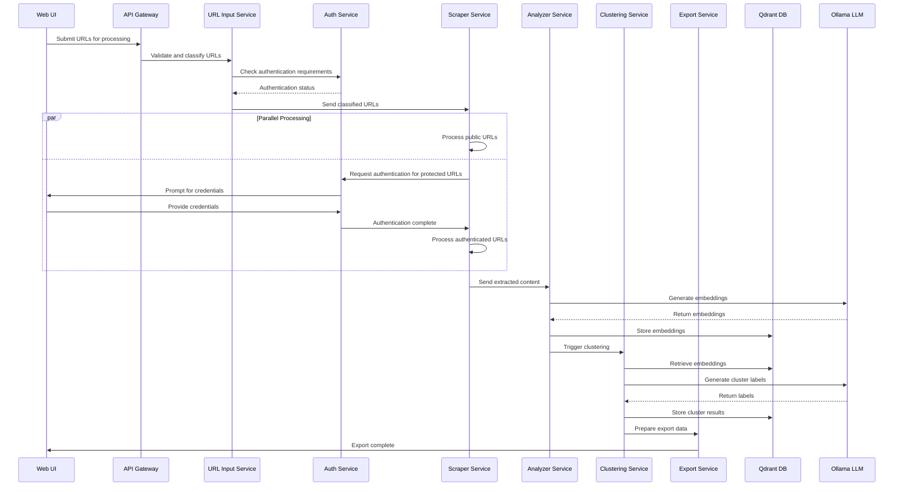
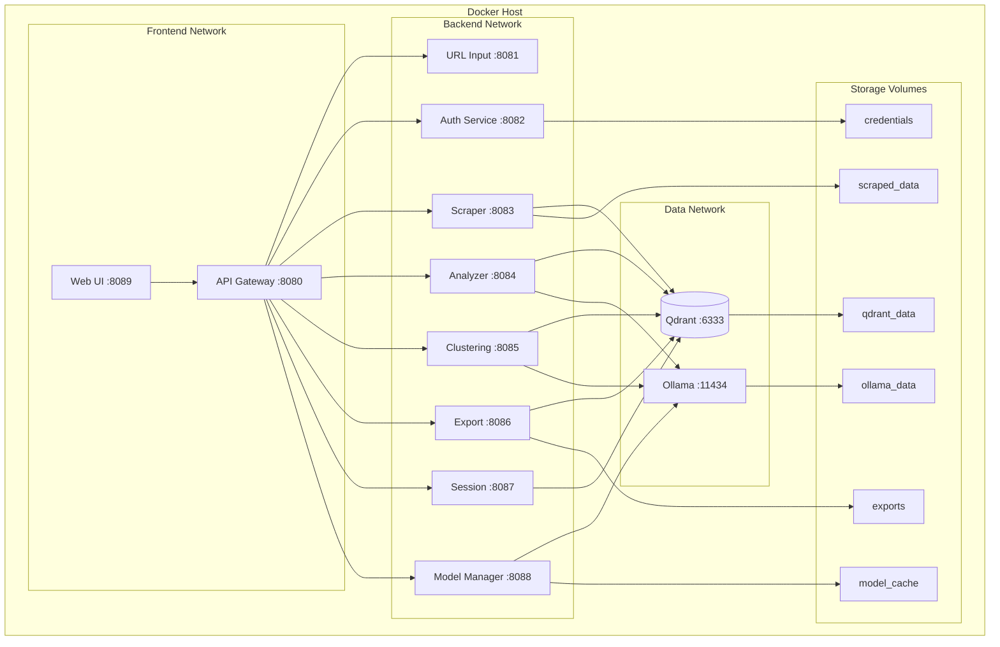
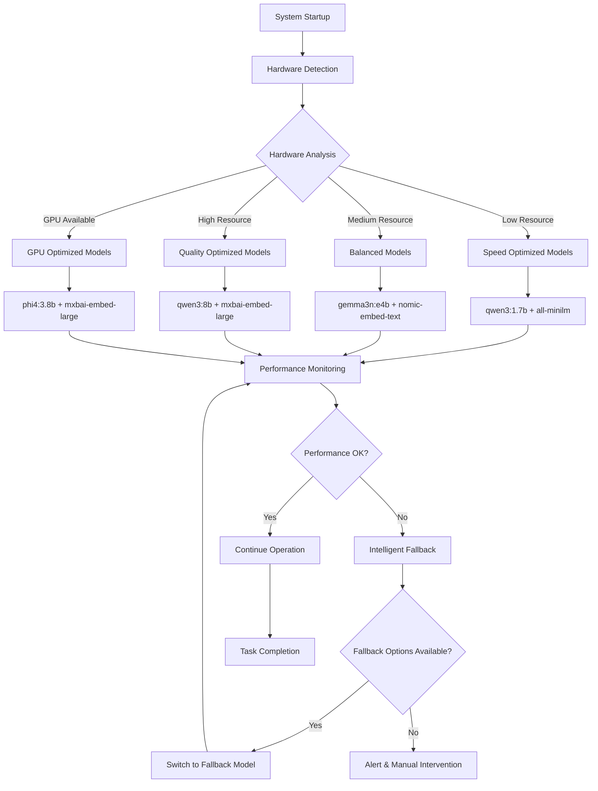

# Architecture Documentation

## Table of Contents
1. [System Overview](#system-overview)
2. [High-Level Architecture](#high-level-architecture)
3. [Core Services](#core-services)
4. [Data Flow](#data-flow)
5. [Technology Stack](#technology-stack)
6. [Container Architecture](#container-architecture)
7. [API Specification](#api-specification)
8. [Security Architecture](#security-architecture)
9. [Performance & Scalability](#performance--scalability)
10. [Deployment Architecture](#deployment-architecture)

## System Overview

The Web Scraping, Analysis & Clustering Tool is a comprehensive microservice-based system that processes web content through a pipeline of specialized services. The architecture emphasizes local AI processing, privacy, and scalability while maintaining simplicity in deployment through Docker containerization. The system operates entirely offline with persistent memory and supports multiple export formats including Notion, Obsidian, Word, and Markdown.

### Key Architectural Principles
- **Microservice Architecture**: 10 independent, containerized services
- **Local AI Processing**: No external API dependencies, complete privacy
- **Parallel Processing**: Simultaneous authentication and scraping workflows
- **Smart Model Management**: Hardware-aware AI model selection and optimization
- **Container-First Design**: All development, testing, and deployment in Docker
- **Event-Driven Communication**: Asynchronous processing with proper orchestration

## High-Level Architecture



### Data Pipeline Flow



### Parallel Processing Architecture



### Service Communication Diagram



## Core Services

### 1. API Gateway (Port 8080)
- **Purpose**: Central orchestration and routing
- **Features**: 
  - Request routing to appropriate services
  - Health monitoring and circuit breakers
  - Job queue management for long-running operations
  - Model-aware load balancing
  - Comprehensive logging with correlation IDs

### 2. URL Input Service (Port 8081)
- **Purpose**: Multi-format URL parsing and validation
- **Features**:
  - File upload support (text, JSON, CSV, Excel)
  - URL validation and format detection
  - Metadata extraction and enrichment
  - Batch processing for large URL lists
  - Preview functionality

### 3. Authentication Service (Port 8082)
- **Purpose**: Secure credential management and authentication
- **Features**:
  - Automatic authentication requirement detection
  - AES-256 encrypted credential storage
  - Popup-based interactive authentication
  - OAuth 2.0 flow handlers
  - Session persistence and renewal
  - Domain authentication mapping

### 4. Web Scraper Service (Port 8083)
- **Purpose**: Content extraction with authentication support
- **Features**:
  - Scrapy-based framework with rate limiting
  - Content extraction using Beautiful Soup and trafilatura
  - Duplicate detection using content hashing
  - Robots.txt compliance
  - Authentication integration
  - Parallel processing of public/authenticated URLs

### 5. Content Analyzer Service (Port 8084)
- **Purpose**: AI-powered content analysis and embedding generation
- **Features**:
  - Configurable embedding models (nomic-embed-text, all-minilm, mxbai-embed-large)
  - Dynamic model selection and switching
  - Text chunking with overlap preservation
  - Keyword extraction and quality assessment
  - Model-specific caching and optimization
  - Hardware-aware model recommendations

### 6. Clustering Service (Port 8085)
- **Purpose**: Intelligent content clustering with visualization
- **Features**:
  - UMAP dimensionality reduction with model-aware optimization
  - HDBSCAN density-based clustering
  - Automatic parameter tuning based on embedding characteristics
  - Cluster quality metrics and stability tracking
  - LLM-powered cluster labeling and summaries
  - Visualization generation (2D/3D plots)

### 7. Export Service (Port 8086)
- **Purpose**: Multi-platform export with customizable formats
- **Features**:
  - Template-based export system using Jinja2
  - Notion API integration
  - Obsidian markdown with internal linking
  - Word document generation
  - Standard markdown with frontmatter
  - Batch export processing

### 8. Session Management Service (Port 8087)
- **Purpose**: Session-based data organization and persistence
- **Features**:
  - Model-aware Qdrant collection management
  - Session metadata tracking with model usage history
  - Incremental clustering for new content
  - Session comparison and evolution tracking
  - Backup/restore with model configurations
  - Data archival and cleanup

### 9. Model Management Service (Port 8088)
- **Purpose**: Advanced AI model lifecycle management with smart LLM chooser
- **Features**:
  - Smart LLM chooser with automatic hardware detection
  - Task-specific model recommendations (reasoning, code, multilingual, multimodal)
  - Dynamic model downloading and installation
  - Intelligent fallback chains for resource constraints
  - Hot model switching without service restart
  - Performance monitoring and resource tracking
  - Automatic cleanup and storage optimization

### 10. Web UI Service (Port 8089)
- **Purpose**: User interface for comprehensive system interaction
- **Features**:
  - URL collection management with status tracking
  - Advanced search capabilities (semantic, keyword, filtering)
  - Chatbot for natural language content queries
  - Session comparison and evolution tracking
  - Real-time processing status and progress monitoring
  - Export template customization and progress tracking

## Container Network Architecture



## Smart Model Selection Flow



## Data Flow

### Primary Workflow
1. **Input**: URLs uploaded via various formats (text, JSON, CSV, Excel)
2. **Validation**: URL parsing, validation, and enrichment
3. **Authentication**: Automatic detection and credential management
4. **Scraping**: Content extraction with authentication support
5. **Analysis**: AI-powered content analysis and embedding generation
6. **Clustering**: Intelligent grouping with LLM-generated labels
7. **Export**: Multi-format output (Notion, Obsidian, Word, Markdown)

### Model Management Flow
1. **Detection**: Hardware capabilities and resource constraints
2. **Recommendation**: Task-specific and performance-optimized model selection
3. **Installation**: Dynamic downloading with validation
4. **Optimization**: Performance monitoring and automatic tuning
5. **Fallback**: Intelligent model switching on failures
6. **Cleanup**: Usage-based retention and storage optimization

## Technology Stack

### Core Infrastructure
- **Containerization**: Docker & Docker Compose
- **API Framework**: FastAPI (Python)
- **Vector Database**: Qdrant
- **AI Models**: Ollama (local LLM hosting)

### AI & Machine Learning
- **LLM Models**: Qwen3, Phi4, Gemma3, Llama3.2, Mistral, CodeLlama
- **Embedding Models**: nomic-embed-text, all-minilm, mxbai-embed-large
- **Clustering**: UMAP + HDBSCAN
- **Content Processing**: Beautiful Soup, trafilatura

### Data Processing
- **Web Scraping**: Scrapy framework
- **File Processing**: pandas, openpyxl
- **Authentication**: Selenium/Playwright for popup handling
- **Encryption**: AES-256 for credential storage

### Export & Integration
- **Template Engine**: Jinja2
- **Document Generation**: python-docx
- **API Integration**: Notion API
- **Markdown Processing**: Standard markdown with frontmatter

## Security Considerations

### Credential Management
- AES-256 encryption for stored credentials
- Master key-based encryption system
- Secure error handling without credential exposure
- Domain-specific credential isolation

### Network Security
- Internal Docker network isolation
- Service-to-service authentication
- Health check endpoints for monitoring
- Structured logging without sensitive data

### Data Privacy
- Local processing (no external API calls)
- Persistent local storage
- Session-based data isolation
- Configurable data retention policies

## Scalability & Performance

### Horizontal Scaling
- Microservice architecture enables independent scaling
- Docker Compose profiles for different deployment scenarios
- Load balancing through API Gateway

### Resource Optimization
- Hardware-aware model selection
- Dynamic model switching based on resource constraints
- Intelligent caching strategies
- Memory management and garbage collection

### Performance Monitoring
- Comprehensive metrics collection
- Model performance tracking
- Resource usage monitoring
- Automatic optimization recommendations

## API Specification

### Core API Endpoints

#### URL Input Service (Port 8081)
```yaml
/urls/validate:
  post:
    summary: Validate single URL
    requestBody:
      content:
        application/json:
          schema:
            type: object
            properties:
              url: {type: string, format: uri}
              validate_accessibility: {type: boolean, default: true}
    responses:
      200:
        description: URL validation result
        content:
          application/json:
            schema:
              type: object
              properties:
                valid: {type: boolean}
                url: {type: string}
                domain: {type: string}
                status_code: {type: integer}
                metadata: {type: object}

/urls/batch:
  post:
    summary: Process multiple URLs
    requestBody:
      content:
        multipart/form-data:
          schema:
            type: object
            properties:
              file: {type: string, format: binary}
              format: {type: string, enum: [text, json, csv, excel]}
    responses:
      202:
        description: Batch processing started
        content:
          application/json:
            schema:
              type: object
              properties:
                job_id: {type: string}
                total_urls: {type: integer}
                estimated_time: {type: string}
```

#### Model Management Service (Port 8088)
```yaml
/models/hardware:
  get:
    summary: Get hardware capabilities
    responses:
      200:
        description: Hardware information
        content:
          application/json:
            schema:
              type: object
              properties:
                cpu: {type: object}
                gpu: {type: object}
                memory: {type: object}
                recommendations: {type: array}

/models/recommend:
  post:
    summary: Get model recommendations
    requestBody:
      content:
        application/json:
          schema:
            type: object
            properties:
              task_type: {type: string, enum: [reasoning, code, multilingual, multimodal]}
              priority: {type: string, enum: [speed, quality, balanced]}
              resource_constraints: {type: object}
    responses:
      200:
        description: Model recommendations
        content:
          application/json:
            schema:
              type: object
              properties:
                recommended_llm: {type: string}
                recommended_embedding: {type: string}
                fallback_chain: {type: array}
                performance_estimate: {type: object}
```

#### Web UI Service (Port 8089)
```yaml
/ui/urls/manage:
  post:
    summary: Manage URL collections
    requestBody:
      content:
        application/json:
          schema:
            type: object
            properties:
              action: {type: string, enum: [add, delete, edit, organize]}
              urls: {type: array}
              collection_id: {type: string}
    responses:
      200:
        description: Operation successful

/ui/chat:
  post:
    summary: Chatbot interaction
    requestBody:
      content:
        application/json:
          schema:
            type: object
            properties:
              message: {type: string}
              session_id: {type: string}
              context: {type: object}
    responses:
      200:
        description: Chatbot response
        content:
          application/json:
            schema:
              type: object
              properties:
                response: {type: string}
                sources: {type: array}
                suggestions: {type: array}
```

## Deployment Architecture

### Development Environment
- Single-machine Docker Compose deployment
- Local model storage and vector database
- Development-optimized model configurations
- Hot reloading for all services
- Containerized testing environment

### Production Considerations
- Persistent volume management with backup strategies
- Backup and disaster recovery procedures
- Monitoring and alerting systems with Prometheus/Grafana
- CI/CD pipeline integration with containerized testing
- Model update and migration procedures
- Horizontal scaling capabilities for high-load scenarios

### Container Orchestration
```yaml
version: '3.8'
services:
  # Core Infrastructure
  qdrant:
    image: qdrant/qdrant:latest
    ports: ["6333:6333"]
    volumes: [qdrant_data:/qdrant/storage]
    
  ollama:
    image: ollama/ollama:latest
    ports: ["11434:11434"]
    volumes: [ollama_data:/root/.ollama]
    
  # All 10 Microservices
  api-gateway:
    build: ./services/api-gateway
    ports: ["8080:8080"]
    depends_on: [qdrant, ollama]
    
  # ... (additional services)
  
volumes:
  qdrant_data:
  ollama_data:
  scraped_data:
  model_cache:
  exports:
  credentials:
```