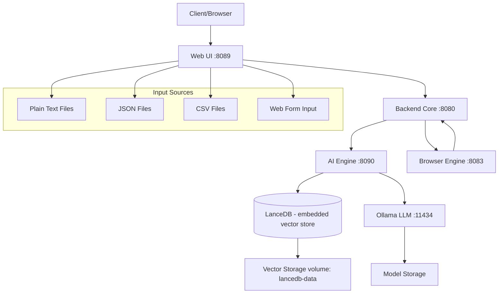
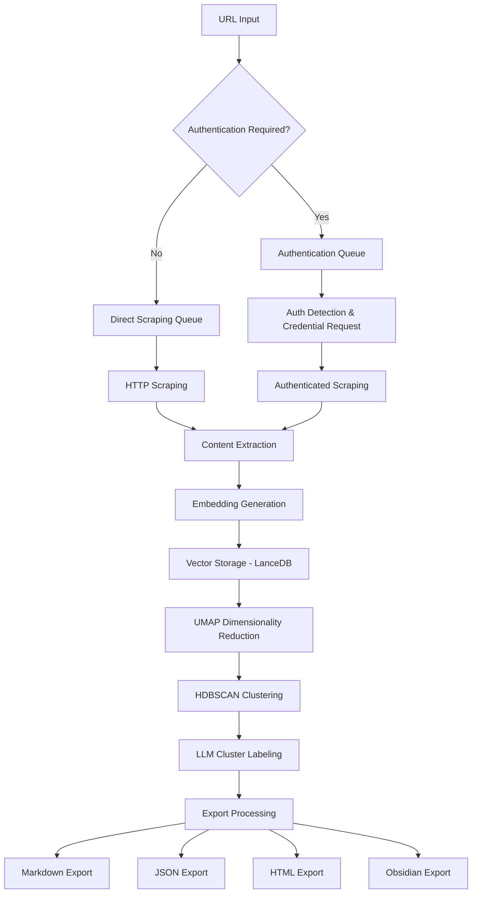
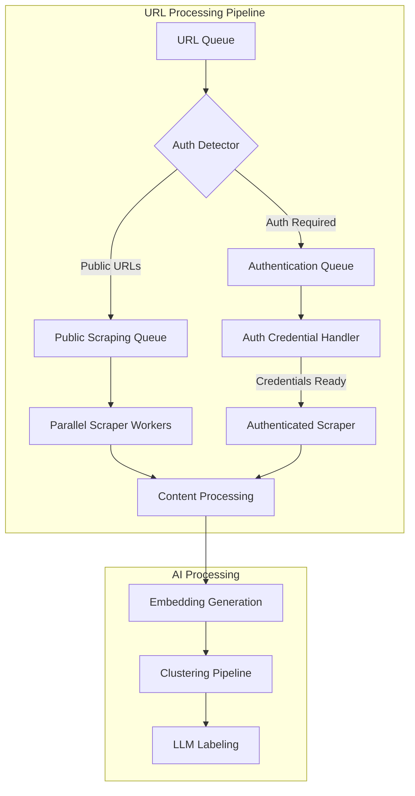
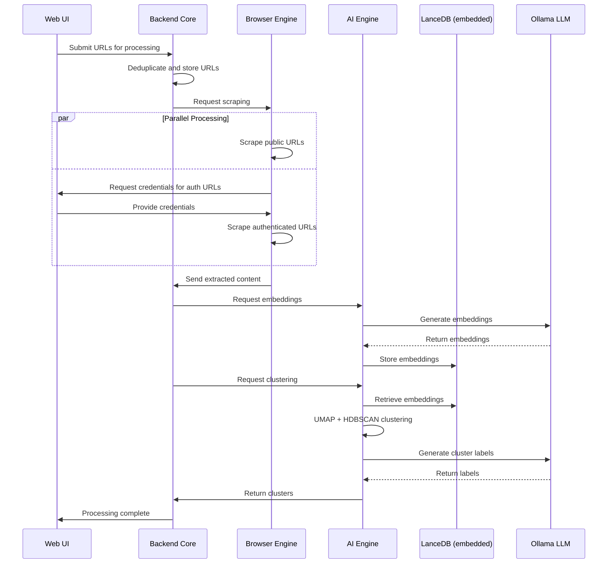
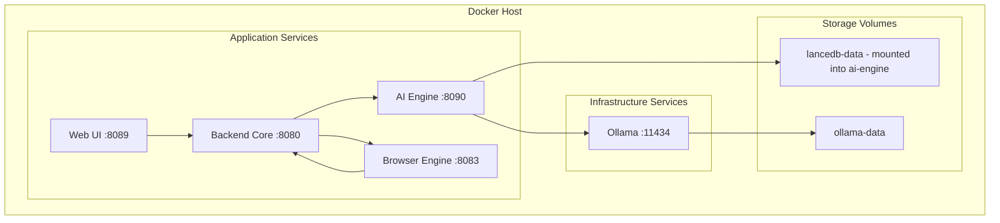
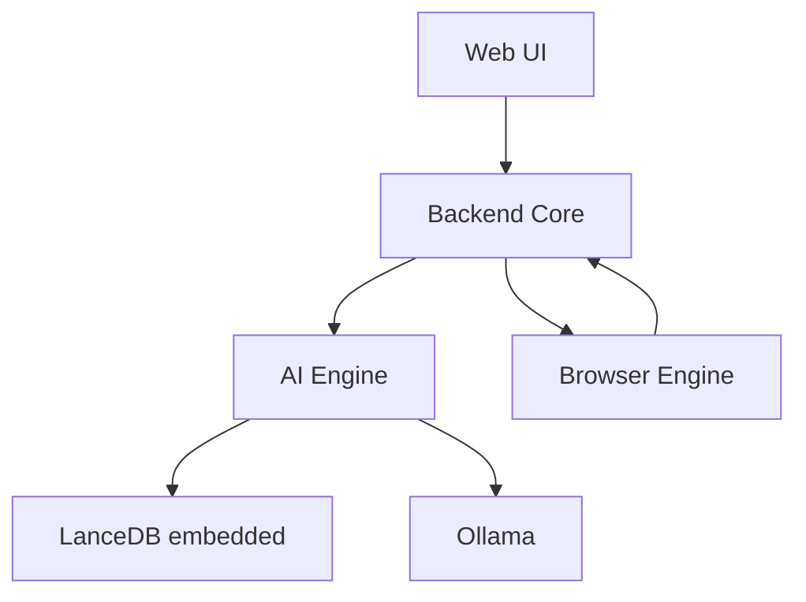

# Architecture Documentation

## Table of Contents
1. [System Overview](#system-overview)
2. [High-Level Architecture](#high-level-architecture)
3. [Core Services](#core-services)
4. [Data Flow](#data-flow)
5. [Technology Stack](#technology-stack)
6. [Container Architecture](#container-architecture)
7. [API Specification](#api-specification)
8. [Security Architecture](#security-architecture)
9. [Performance & Scalability](#performance--scalability)
10. [Deployment Architecture](#deployment-architecture)

## System Overview

The Tab Organizer is a microservice-based system that processes web content through a pipeline of specialized services. The architecture emphasizes local AI processing, privacy, and scalability while maintaining simplicity in deployment through Docker containerization. The system operates with optional offline capability and supports multiple export formats including Markdown, JSON, HTML, and Obsidian.

### Key Architectural Principles
- **Microservice Architecture**: 4 core services with clear separation of concerns
- **Multi-Provider AI**: Support for local (Ollama) and cloud AI providers (OpenRouter, OpenAI, Anthropic, DeepSeek, Gemini). OpenRouter is the docker-compose default; Ollama is the `.env.example` default for fully local runs.
- **Parallel Processing**: Non-blocking authentication and scraping workflows
- **Container-First Design**: All development, testing, and deployment in Docker
- **Event-Driven Communication**: Asynchronous processing with proper orchestration

## High-Level Architecture


```mermaid
graph TB
    Client[Client/Browser] --> UI[Web UI :8089]
    
    UI --> Backend[Backend Core :8080]
    
    Backend --> AI[AI Engine :8090]
    Backend --> Browser[Browser Engine :8083]
    
    AI --> LanceDB[(LanceDB - embedded vector store)]
    AI --> Ollama[Ollama LLM :11434]
    Browser --> Backend
    
    LanceDB --> Storage1[Vector Storage volume: lancedb-data]
    Ollama --> Storage2[Model Storage]
    
    subgraph "Input Sources"
        TextFile[Plain Text Files]
        JSONFile[JSON Files]
        CSVFile[CSV Files]
        WebForm[Web Form Input]
    end
    
    UI --> TextFile
    UI --> JSONFile
    UI --> CSVFile
    UI --> WebForm
```

### Data Pipeline Flow


```mermaid
flowchart TD
    A[URL Input] --> B{Authentication Required?}
    B -->|No| C[Direct Scraping Queue]
    B -->|Yes| D[Authentication Queue]
    
    C --> E[HTTP Scraping]
    D --> F[Auth Detection & Credential Request]
    F --> G[Authenticated Scraping]
    
    E --> H[Content Extraction]
    G --> H
    
    H --> I[Embedding Generation]
    I --> J[Vector Storage - LanceDB]
    
    J --> K[UMAP Dimensionality Reduction]
    K --> L[HDBSCAN Clustering]
    L --> M[LLM Cluster Labeling]
    
    M --> N[Export Processing]
    
    N --> O[Markdown Export]
    N --> P[JSON Export]
    N --> Q[HTML Export]
    N --> R[Obsidian Export]
```

### Parallel Processing Architecture


```mermaid
graph TB
    subgraph "URL Processing Pipeline"
        URLQueue[URL Queue] --> URLClassifier{Auth Detector}
        URLClassifier -->|Public URLs| PublicQueue[Public Scraping Queue]
        URLClassifier -->|Auth Required| AuthQueue[Authentication Queue]
        
        PublicQueue --> ScraperPool[Parallel Scraper Workers]
        AuthQueue --> AuthHandler[Auth Credential Handler]
        AuthHandler -->|Credentials Ready| AuthScraper[Authenticated Scraper]
        
        ScraperPool --> ContentProcessor[Content Processing]
        AuthScraper --> ContentProcessor
    end
    
    subgraph "AI Processing"
        ContentProcessor --> EmbeddingService[Embedding Generation]
        EmbeddingService --> ClusteringService[Clustering Pipeline]
        ClusteringService --> LLMService[LLM Labeling]
    end
```

### Service Communication Diagram


```mermaid
sequenceDiagram
    participant UI as Web UI
    participant BE as Backend Core
    participant BR as Browser Engine
    participant AI as AI Engine
    participant Q as LanceDB (embedded)
    participant O as Ollama LLM

    UI->>BE: Submit URLs for processing
    BE->>BE: Deduplicate and store URLs
    BE->>BR: Request scraping
    
    par Parallel Processing
        BR->>BR: Scrape public URLs
    and
        BR->>UI: Request credentials for auth URLs
        UI->>BR: Provide credentials
        BR->>BR: Scrape authenticated URLs
    end
    
    BR->>BE: Send extracted content
    BE->>AI: Request embeddings
    AI->>O: Generate embeddings
    O-->>AI: Return embeddings
    AI->>Q: Store embeddings
    
    BE->>AI: Request clustering
    AI->>Q: Retrieve embeddings
    AI->>AI: UMAP + HDBSCAN clustering
    AI->>O: Generate cluster labels
    O-->>AI: Return labels
    AI->>BE: Return clusters
    
    BE->>UI: Processing complete
```

## Core Services

### 1. Backend Core (Port 8080)
**Purpose**: API Gateway, session management, and URL storage

**Responsibilities**:
- Session lifecycle management
- URL deduplication and storage
- Export functionality (Markdown, JSON, HTML, Obsidian)
- Orchestration of scraping and clustering workflows
- Health monitoring

**Key Components**:
- `app/api/routes.py` - FastAPI routes
- `app/url_input/store.py` - URL storage with deduplication
- `app/url_input/dedup.py` - URL normalization and deduplication
- `app/sessions/manager.py` - Session management
- `app/export/exporter.py` - Multi-format export

**Technology**: FastAPI, Python 3.12

### 2. AI Engine (Port 8090)
**Purpose**: AI services for embeddings, clustering, and chatbot

**Responsibilities**:
- Multi-provider LLM support (OpenRouter, Ollama, OpenAI, Anthropic, DeepSeek, Gemini)
- Embedding generation with configurable models
- UMAP + HDBSCAN clustering pipeline
- RAG-based chatbot with LanceDB vector search (native LanceDB query/search APIs)
- Dynamic provider switching

**Key Components**:
- `app/core/llm_client.py` - Unified LLM client
- `app/providers/` - Provider implementations
- `app/clustering/pipeline.py` - Clustering pipeline
- `app/chatbot/rag.py` - RAG chatbot

**Technology**: FastAPI, UMAP, HDBSCAN, LanceDB (embedded), Python 3.12

### 3. Browser Engine (Port 8083)
**Purpose**: Web scraping and authentication handling

**Responsibilities**:
- HTTP-based content scraping
- Authentication detection and credential management
- Parallel processing of public and authenticated URLs
- Content extraction and cleaning
- Robots.txt compliance

**Key Components**:
- `app/scraper/engine.py` - Scraping engine
- `app/auth/detector.py` - Authentication detection
- `app/auth/queue.py` - Authentication queue management
- `app/extraction/` - Content extraction utilities

**Technology**: FastAPI, httpx, BeautifulSoup, trafilatura, Python 3.12

### 4. Web UI (Port 8089)
**Purpose**: Streamlit-based user interface

**Responsibilities**:
- URL input and management
- Scraping progress monitoring
- Clustering visualization
- RAG chatbot interface
- Export and settings management

**Key Components**:
- `src/pages/url_input.py` - URL input page
- `src/pages/scraping.py` - Scraping page
- `src/pages/clustering.py` - Clustering page
- `src/pages/chatbot.py` - Chatbot page
- `src/pages/settings.py` - Settings page
- `src/api/client.py` - Backend API client

**Technology**: Streamlit, Python 3.12

## Container Network Architecture


```mermaid
graph TB
    subgraph "Docker Host"
        subgraph "Application Services"
            UI[Web UI :8089]
            Backend[Backend Core :8080]
            AI[AI Engine :8090]
            Browser[Browser Engine :8083]
        end
        
        subgraph "Infrastructure Services"
            OLLAMA[Ollama :11434]
        end
        
        subgraph "Storage Volumes"
            V1[lancedb-data - mounted into ai-engine]
            V2[ollama-data]
        end
    end
    
    UI --> Backend
    Backend --> AI
    Backend --> Browser
    Browser --> Backend
    
    AI --> OLLAMA
    AI --> V1
    OLLAMA --> V2
```

## Data Flow

### Primary Workflow
1. **Input**: URLs added via web UI (paste, upload file)
2. **Deduplication**: URL normalization and duplicate detection
3. **Authentication**: Automatic detection and credential request
4. **Scraping**: Parallel content extraction (public + authenticated)
5. **Analysis**: AI-powered embedding generation
6. **Clustering**: UMAP + HDBSCAN with LLM-generated labels
7. **Export**: Multi-format output (Markdown, JSON, HTML, Obsidian)

### Session Management
1. **Creation**: New session with unique ID
2. **URL Storage**: Deduplicated URL collection
3. **Processing**: Scraping and clustering workflows
4. **Persistence**: Session data stored in LanceDB tables on disk (volume `lancedb-data`)
5. **Export**: Session data exported in various formats

## Technology Stack

### Core Infrastructure
- **Containerization**: Docker & Docker Compose
- **API Framework**: FastAPI (Python 3.12)
- **Vector Database**: LanceDB (embedded, file-backed)
- **AI Models**: Ollama (local) or cloud providers

### AI & Machine Learning
- **LLM Providers**: OpenRouter, Ollama, OpenAI, Anthropic Claude, DeepSeek, Google Gemini
- **Embedding Models**: `nvidia/llama-nemotron-embed-vl-1b-v2:free` (OpenRouter, 1024-dim, default), `nomic-embed-text` (Ollama, 768-dim), `text-embedding-3-small` (OpenAI, 1536-dim), `text-embedding-004` (Gemini, 768-dim)
- **Clustering**: UMAP + HDBSCAN
- **Content Processing**: BeautifulSoup, trafilatura

### Data Processing
- **Web Scraping**: httpx, BeautifulSoup
- **Authentication**: Credential detection and management
- **File Processing**: CSV, JSON, text file parsing

### Export & Integration
- **Template Engine**: Jinja2
- **Export Formats**: Markdown, JSON, HTML, Obsidian
- **Vector Search**: LanceDB native search/query APIs powering the RAG chatbot

## Security Considerations

### Credential Management
- Encrypted credential storage
- Domain-specific credential isolation
- Secure error handling without credential exposure

### Network Security
- Internal Docker network isolation
- Service-to-service communication within Docker network
- Health check endpoints for monitoring
- No external API calls for local mode

### Data Privacy
- Optional local processing (Ollama mode)
- Persistent local storage
- Session-based data isolation
- Configurable data retention

## Scalability & Performance

### Horizontal Scaling
- Microservice architecture enables independent scaling
- Docker Compose profiles for different deployment scenarios
- Stateless services (except the AI Engine's LanceDB volume and Ollama's model cache)

### Resource Optimization
- Configurable AI provider selection
- Dynamic model switching
- Parallel scraping with configurable concurrency
- Efficient on-disk vector storage with LanceDB

### Performance Monitoring
- Health check endpoints on all services
- Service status monitoring
- Resource usage tracking

## API Specification

### Backend Core (Port 8080)

| Endpoint | Method | Description |
|----------|--------|-------------|
| `/api/v1/sessions` | POST | Create new session |
| `/api/v1/sessions` | GET | List all sessions |
| `/api/v1/sessions/{session_id}` | GET | Get session details |
| `/api/v1/sessions/{session_id}` | DELETE | Delete a session |
| `/api/v1/urls` | POST | Add URLs to session |
| `/api/v1/urls/{session_id}` | GET | Get session URLs |
| `/api/v1/scrape` | POST | Start scraping |
| `/api/v1/scrape/status/{session_id}` | GET | Get scrape status (proxy to browser-engine) |
| `/api/v1/cluster` | POST | Start clustering |
| `/api/v1/clusters/{session_id}` | GET | Get clustering result |
| `/api/v1/export` | POST | Export session |
| `/api/v1/auth/pending` | GET | List domains awaiting credentials |
| `/api/v1/auth/credentials` | POST | Submit credentials for a pending domain |
| `/api/v1/callback/scrape-complete` | POST | Internal callback used by browser-engine when scraping finishes |
| `/api/v1/health` | GET | Health check |

### AI Engine (Port 8090)

| Endpoint | Method | Description |
|----------|--------|-------------|
| `/health` | GET | Health check (also reports LanceDB readiness) |
| `/providers` | GET | Get provider/model info |
| `/providers/switch` | POST | Hot-swap LLM/embedding providers |
| `/embed` | POST | Generate embeddings |
| `/generate` | POST | Generic LLM completion |
| `/cluster` | POST | UMAP + HDBSCAN + LLM cluster labeling |
| `/index` | POST | Index documents into LanceDB |
| `/chat` | POST | RAG chat over indexed content |
| `/search` | POST | Vector search over indexed content |
| `/summarize/{session_id}` | GET | Summarize a session's content |
| `/documents/{session_id}` | DELETE | Drop a session's indexed documents |

### Browser Engine (Port 8083)

| Endpoint | Method | Description |
|----------|--------|-------------|
| `/health` | GET | Health check |
| `/scrape` | POST | Start batch scraping |
| `/scrape/single` | POST | Scrape single URL |
| `/scrape/status/{session_id}` | GET | Get scrape status |
| `/detect-auth` | POST | Probe a URL to detect auth requirements |
| `/auth/pending` | GET | All pending auth requests across sessions |
| `/auth/pending/{session_id}` | GET | Pending auth requests for a session |
| `/auth/pending/{domain}` | DELETE | Drop a pending auth request |
| `/auth/credentials` | POST | Submit credentials |
| `/auth/expire` | POST | Force-expire a stored credential |

## Deployment Architecture

### Development Environment
- Single-machine Docker Compose deployment
- Local model storage and vector database
- Hot reloading for all services
- Containerized testing environment

### Production Considerations
- Persistent volume management
- Backup and disaster recovery
- Monitoring and alerting
- CI/CD pipeline integration
- Model update procedures
- Horizontal scaling for high load

### Container Orchestration
```yaml
services:
  # Infrastructure
  ollama:
    image: ollama/ollama:latest
    ports: ["11434:11434"]
    volumes: [ollama-data:/root/.ollama]

  # Application Services
  ai-engine:
    build: ./services/ai-engine
    ports: ["8090:8090"]
    environment:
      VECTOR_DB_PATH: /data/lancedb
    depends_on: [ollama]
    volumes: [lancedb-data:/data/lancedb]

  backend-core:
    build: ./services/backend-core
    ports: ["8080:8080"]
    depends_on: [ai-engine, browser-engine]

  browser-engine:
    build: ./services/browser-engine
    ports: ["8083:8083"]

  web-ui:
    build: ./services/web-ui
    ports: ["8089:8089"]
    depends_on: [backend-core]

volumes:
  lancedb-data:
  ollama-data:
```

## Service Dependencies


```mermaid
graph TD
    UI[Web UI] --> Backend[Backend Core]
    Backend --> AI[AI Engine]
    Backend --> Browser[Browser Engine]
    AI --> LanceDB[LanceDB embedded]
    AI --> Ollama[Ollama]
    Browser --> Backend
```

### Startup Order
1. Ollama (LLM server)
2. AI Engine (mounts LanceDB volume; depends on Ollama)
3. Browser Engine (independent)
4. Backend Core (depends on AI Engine, Browser Engine)
5. Web UI (depends on Backend Core)

### Health Checks
All services expose `/health` endpoints for monitoring:
- Backend Core: `http://localhost:8080/health`
- AI Engine: `http://localhost:8090/health` (also reports LanceDB readiness)
- Browser Engine: `http://localhost:8083/health`
- Ollama: `http://localhost:11434/`
