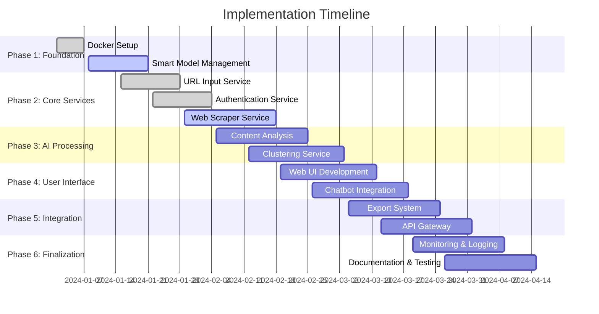
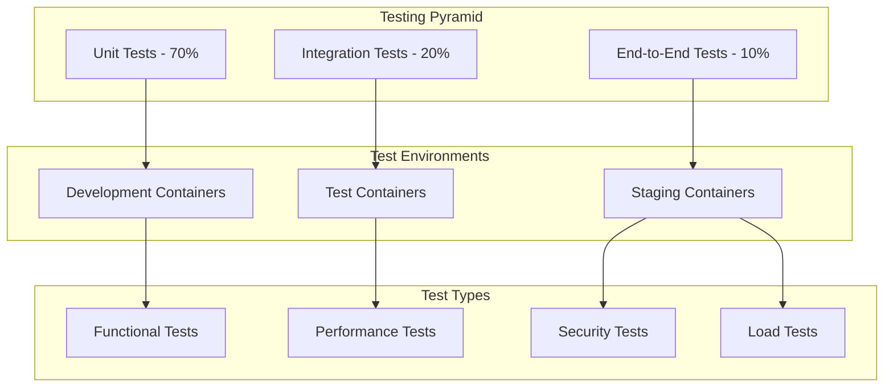

# Development Guide

## Table of Contents
1. [Development Workflow](#development-workflow)
2. [Implementation Status](#implementation-status)
3. [Development Setup](#development-setup)
4. [Service Development Guidelines](#service-development-guidelines)
5. [Testing Strategy](#testing-strategy)
6. [Code Quality Standards](#code-quality-standards)
7. [Git Workflow](#git-workflow)
8. [Debugging and Troubleshooting](#debugging-and-troubleshooting)
9. [Contributing Guidelines](#contributing-guidelines)
10. [Deployment](#deployment)

## Development Workflow

This project follows a spec-driven development methodology with incremental implementation and comprehensive containerized testing at each stage.

### Key Development Principles
- **Container-First Development**: All development, testing, and deployment occurs within Docker containers
- **Parallel Development**: Tasks are structured to allow parallel development of independent services
- **Test-Driven Development**: Each task includes comprehensive testing requirements
- **Incremental Delivery**: Each completed task delivers working functionality
- **Microservice Architecture**: Independent, scalable services with clear boundaries

### Development Timeline



## Implementation Status

### ✅ Completed Tasks (40% Complete)

#### 1. Core Infrastructure Setup
- [x] **Docker Compose configuration** for 4 core services
- [x] **Qdrant vector database** with persistent storage and collection management
- [x] **Ollama LLM service** with model management and hot-swapping
- [x] **Backend Core** with API Gateway, session management, and URL storage
- [x] **Inter-service communication** and Docker networking
- [x] **Logging and monitoring** infrastructure with structured logs

#### 2. URL Input Service (Complete)
- [x] **FastAPI service** for multi-format URL input processing
- [x] **File upload endpoints** (text, JSON, CSV, Excel) with validation
- [x] **URL validation and format detection** utilities
- [x] **Metadata extraction** (domain, path, parameters)
- [x] **Unit tests** for URL parsing and validation
- [x] **Batch processing** for large URL lists

#### 3. Authentication Service (Complete)
- [x] **Authentication detection** algorithms for various auth types
- [x] **Secure credential storage** with AES-256 encryption
- [x] **Interactive authentication** workflows with popup handling
- [x] **Session management** and credential storage
- [x] **OAuth 2.0 support** and domain authentication mapping
- [x] **Integration tests** for authentication flows

#### 4. Smart Model Management System (Complete)
- [x] **Hardware detection** and model recommendation system
- [x] **Smart LLM chooser** with automatic hardware analysis
- [x] **Task-specific recommendations** (reasoning, code, multilingual, multimodal)
- [x] **Dynamic model downloading** and installation
- [x] **Intelligent fallback chains** for resource constraints
- [x] **Hot model switching** without service restart
- [x] **Performance monitoring** and resource tracking

#### 5. Content Analysis Foundation (Complete)
- [x] **Configurable embedding generation** system
- [x] **Multiple model support** (nomic-embed-text, all-minilm, mxbai-embed-large)
- [x] **Ollama integration** with multiple LLM models
- [x] **Qdrant vector database** integration
- [x] **Model switching** and configuration management
- [x] **Hardware detection** for optimal model selection

#### 6. Clustering System Foundation (Complete)
- [x] **UMAP dimensionality reduction** with model-aware optimization
- [x] **Configurable UMAP parameters** based on embedding model
- [x] **Batch processing** for large embedding datasets
- [x] **Visualization generation** for 2D/3D cluster plots
- [x] **Automatic parameter tuning** based on embedding characteristics
- [x] **Unit tests** for dimensionality reduction accuracy

### 🚧 In Progress (6.7% of Total)

#### 7. Web Scraper Service with Parallel Authentication Workflow
- [x] **FastAPI scraper service** with Scrapy framework in Docker container
- [x] **Parallel processing architecture** - separate authenticated and non-authenticated URLs into different queues
- [ ] **URL classifier** to identify authentication requirements and route to appropriate processing queues
- [ ] **Content extraction** with multiple parsing strategies (Beautiful Soup, trafilatura)
- [ ] **Rate limiting and respectful crawling** mechanisms with robots.txt compliance
- [ ] **Duplicate detection** using content hashing and parallel worker pools
- [ ] **Error handling and retry logic** with exponential backoff for failed requests
- [ ] **Support for different content types** (HTML, PDF) and content quality assessment
- [ ] **Real-time status tracking** for parallel scraping and authentication tasks
- [ ] **Containerized integration tests** with authentication service and comprehensive error logging

**Current Sprint Goal**: Complete Web Scraper Service with Parallel Authentication Workflow
**Estimated Completion**: 2024-02-18
**Progress**: 20% complete

### 📋 Upcoming Tasks (53.3% Remaining)

#### 8. Advanced Clustering and Similarity Analysis
- [ ] **HDBSCAN clustering** with parameter optimization
- [ ] **Cluster validation** and quality metrics
- [ ] **Hierarchical clustering** visualization
- [ ] **Vector similarity search** using embeddings
- [ ] **Recommendation algorithms** based on user behavior
- [ ] **Content-based filtering** and collaborative filtering
- [ ] **Performance tests** for search efficiency

#### 9. Web UI and User Interaction System
- [ ] **React/Vue.js web interface** containerized with Docker
- [ ] **URL management system**: add, delete, edit, organize URLs in collections
- [ ] **Advanced search interface** with semantic search, keyword search, and filtering
- [ ] **Real-time status display** for URLs (pending, scraping, completed, failed, authentication required)
- [ ] **Content preview capabilities** with metadata display and cluster assignments
- [ ] **Session management UI** for creating, switching, comparing, and managing analysis sessions
- [ ] **Chatbot system** using local LLM models for natural language content queries
- [ ] **Semantic search integration** for answering questions about scraped content

#### 10. Export and Integration System
- [ ] **Multi-format export system** (Notion, Obsidian, Word, Markdown)
- [ ] **Template-based export** using Jinja2 engine
- [ ] **Customizable export templates** and filters
- [ ] **Batch export** for large datasets
- [ ] **API endpoints** for programmatic export
- [ ] **Export progress tracking** and monitoring

#### 11. Session Management and Persistence
- [ ] **Session lifecycle management** (creation, management, cleanup)
- [ ] **Session persistence** with metadata storage
- [ ] **Incremental clustering** for new content
- [ ] **Session comparison** and evolution tracking
- [ ] **Session sharing** and collaboration features
- [ ] **Backup/restore functionality** with model configurations

#### 12. API Gateway and Service Orchestration
- [ ] **Centralized API gateway** with service discovery
- [ ] **Request routing** and load balancing
- [ ] **Authentication and authorization** middleware
- [ ] **Rate limiting** and monitoring capabilities
- [ ] **Circuit breaker patterns** and graceful degradation
- [ ] **Job queue management** for long-running operations

#### 13. Data Pipeline Visualization and Documentation
- [ ] **Mermaid diagrams** for complete system architecture and data flow
- [ ] **Interactive pipeline visualization** dashboard showing real-time processing status
- [ ] **Service interaction diagrams** with API endpoints and data models
- [ ] **Capacity planning visualizations** and resource allocation diagrams
- [ ] **Troubleshooting tools** with pipeline bottleneck identification
- [ ] **Auto-generated architecture documentation** from code and configuration

#### 14. Comprehensive Testing and CI/CD
- [ ] **Docker-based testing environments** for all services with proper isolation
- [ ] **Containerized unit tests**, integration tests, and end-to-end tests
- [ ] **Docker Compose** for orchestrating test environments with test data management
- [ ] **Containerized CI/CD pipeline** with automated testing and deployment
- [ ] **Containerized load testing** and performance benchmarking
- [ ] **Container-based debugging** capabilities with proper logging and monitoring

#### 15. Monitoring, Logging, and Performance Optimization
- [ ] **Centralized logging** with structured logs across all containerized services
- [ ] **Performance monitoring** and metrics collection for containerized microservices
- [ ] **Health checks** and service monitoring with Docker health checks
- [ ] **Alerting and notification system** for container and service failures
- [ ] **Resource usage monitoring** for containers and AI model performance
- [ ] **Distributed tracing** across microservices for request flow monitoring

## Development Setup

### Prerequisites
- Docker and Docker Compose
- Python 3.11+
- Git

### Local Development Environment

1. **Clone the repository**:
```bash
git clone <repository-url>
cd web-scraping-clustering-tool
```

2. **Set up environment**:
```bash
./scripts/init.py --provider ollama   # or --provider claude
```

3. **Start development services**:
```bash
./scripts/cli.py start
```

4. **Run tests**:
```bash
./scripts/cli.py test --type unit
```

## Service Development Guidelines

### Creating a New Service

1. **Create service directory**:
```bash
mkdir services/new-service
cd services/new-service
```

2. **Create basic structure**:
```
services/new-service/
├── main.py              # FastAPI application
├── requirements.txt     # Python dependencies
├── Dockerfile          # Container configuration
├── test_*.py           # Unit tests
└── README.md           # Service documentation
```

3. **Implement FastAPI service**:
```python
from fastapi import FastAPI
import structlog

logger = structlog.get_logger()
app = FastAPI(title="New Service", version="1.0.0")

@app.get("/health")
async def health_check():
    return {"status": "healthy", "service": "new-service"}
```

4. **Add to Docker Compose**:
```yaml
new-service:
  build:
    context: ./services/new-service
  ports:
    - "808X:808X"
  networks:
    - scraping_network
```

## Testing Strategy

### Containerized Testing Framework



### Test Coverage Requirements

| Service | Unit Tests | Integration Tests | E2E Tests | Performance Tests |
|---------|------------|-------------------|-----------|-------------------|
| API Gateway | 95% | ✅ | ✅ | ✅ |
| URL Input | 90% | ✅ | ✅ | ❌ |
| Authentication | 95% | ✅ | ✅ | ❌ |
| Web Scraper | 90% | ✅ | ✅ | ✅ |
| Content Analyzer | 90% | ✅ | ✅ | ✅ |
| Clustering | 85% | ✅ | ✅ | ✅ |
| Export | 85% | ✅ | ✅ | ❌ |
| Session Manager | 90% | ✅ | ✅ | ❌ |
| Model Manager | 95% | ✅ | ✅ | ✅ |
| Web UI | 80% | ✅ | ✅ | ✅ |

### Automated Testing Pipeline

The unified `docker-compose.yml` exposes dedicated profiles for every test stage:

- `test-unit` — spins up per-service unit runners (Python + Jest).
- `test-integration` — provisions ephemeral Qdrant/Ollama plus integration runners.
- `test-e2e` — boots API/UI facades and executes the pytest E2E suite.
- `test-performance` — launches Locust against the test API gateway.
- `test-report` — aggregates coverage artifacts when present.

Use `docker compose --profile <name> up ...` or the convenience wrappers in `scripts/cli.py test` to run the desired workflows.

#### Unit Tests
- **Framework**: pytest with async support running in dedicated test containers
- **Coverage Target**: 85-95% depending on service criticality
- **Container Setup**: Each service has its own test container with isolated test databases
- **Test Categories**:
  - Model validation and serialization
  - Business logic and algorithms
  - Smart LLM chooser functionality
  - Parallel processing coordination
  - Authentication workflow testing

#### Integration Tests
- **Service Communication**: Test inter-service APIs using Docker Compose test networks
- **Database Operations**: Test data persistence and retrieval with containerized test databases
- **External Dependencies**: Test Qdrant, Ollama integration in isolated container environments
- **End-to-End Workflows**: Complete user journeys tested across containerized services
- **Parallel Processing**: Test authentication and scraping workflows in parallel container environments

#### Performance Tests
- **Load Testing**: Concurrent user simulation using containerized load testing tools
- **Stress Testing**: Resource limit validation within container constraints
- **Benchmark Testing**: Algorithm performance measurement in standardized container environments
- **Memory Testing**: Container memory usage and leak detection
- **Model Performance**: Benchmarking of different AI models within container resource limits

#### Example Test Structure:
```python
import pytest
from main import URLValidator, URLParser, SmartModelChooser

class TestURLValidator:
    def test_valid_urls(self):
        valid_urls = ["https://example.com", "http://test.org"]
        for url in valid_urls:
            assert URLValidator.is_valid_url(url)
    
    def test_invalid_urls(self):
        invalid_urls = ["not-a-url", "ftp://example.com"]
        for url in invalid_urls:
            assert not URLValidator.is_valid_url(url)

class TestSmartModelChooser:
    def test_hardware_detection(self):
        chooser = SmartModelChooser()
        hardware = chooser.detect_hardware()
        assert "cpu" in hardware
        assert "memory" in hardware
        assert "gpu" in hardware
    
    def test_model_recommendation(self):
        chooser = SmartModelChooser()
        recommendation = chooser.recommend_model(
            task_type="reasoning",
            priority="balanced",
            hardware_constraints={"memory": "8GB"}
        )
        assert recommendation["llm_model"] is not None
        assert recommendation["embedding_model"] is not None
        assert len(recommendation["fallback_chain"]) > 0

class TestParallelProcessing:
    @pytest.mark.asyncio
    async def test_parallel_authentication_workflow(self):
        urls = [
            "https://public-site.com",
            "https://auth-required-site.com"
        ]
        processor = ParallelURLProcessor()
        results = await processor.process_urls(urls)
        
        assert len(results["public_queue"]) == 1
        assert len(results["auth_queue"]) == 1
        assert results["processing_time"] < 300  # 5 minutes max
```

### Code Quality Standards

#### Python Code Style
- Follow PEP 8 style guidelines
- Use type hints for function parameters and returns
- Include docstrings for all public functions
- Use meaningful variable and function names

#### Error Handling
- Use structured logging with correlation IDs
- Implement graceful degradation
- Provide clear error messages
- Don't expose sensitive information in errors

#### Example Error Handling:
```python
import structlog

logger = structlog.get_logger()

try:
    result = process_urls(urls)
    logger.info("URLs processed successfully", count=len(result))
    return result
except ValidationError as e:
    logger.error("URL validation failed", error=str(e))
    raise HTTPException(status_code=400, detail="Invalid URL format")
except Exception as e:
    logger.error("Unexpected error", error=str(e))
    raise HTTPException(status_code=500, detail="Internal server error")
```

## Git Workflow

### Commit Message Format
Follow conventional commit format:
```
type(scope): description

feat(url-input): add csv file upload support
fix(scraper): handle authentication timeout
docs(readme): update installation instructions
test(analyzer): add unit tests for embedding generation
```

### Branch Strategy
- `main`: Production-ready code
- `develop`: Integration branch for features
- `feature/task-name`: Individual task implementation
- `hotfix/issue-name`: Critical bug fixes

### Commit Guidelines
- Make atomic commits (one logical change per commit)
- Include tests with feature commits
- Update documentation when needed
- Reference issue numbers when applicable

## Debugging and Troubleshooting

### Service Logs
```bash
# View all service logs
./scripts/cli.py logs

# View specific service logs
./scripts/cli.py logs url-input-service

# Follow logs in real-time
docker compose logs -f url-input-service
```

### Health Checks
```bash
# Check all services
curl http://localhost:8080/health

# Check specific service
curl http://localhost:8081/health
```

### Common Issues

#### Service Won't Start
1. Check Docker Compose configuration
2. Verify port conflicts
3. Check service dependencies
4. Review service logs for errors

#### Tests Failing
1. Ensure test environment is clean
2. Check test data and fixtures
3. Verify mock configurations
4. Run tests in isolation

#### Performance Issues
1. Monitor resource usage
2. Check model configurations
3. Review caching strategies
4. Optimize database queries

## Contributing Guidelines

### Before Starting Development
1. Check existing issues and tasks
2. Discuss major changes in issues
3. Follow the established architecture
4. Write tests for new functionality

### Pull Request Process
1. Create feature branch from develop
2. Implement changes with tests
3. Update documentation if needed
4. Ensure all tests pass
5. Submit pull request with clear description

### Code Review Checklist
- [ ] Code follows style guidelines
- [ ] Tests are included and passing
- [ ] Documentation is updated
- [ ] Error handling is appropriate
- [ ] Performance considerations addressed
- [ ] Security implications reviewed

## Deployment

### Development Deployment
```bash
# Start all services
./scripts/cli.py start

# Stop all services
./scripts/cli.py stop

# Restart specific service
docker compose restart url-input-service
```

### Production Considerations
- Use production Docker Compose configuration
- Implement proper backup strategies
- Set up monitoring and alerting
- Configure log aggregation
- Plan for model updates and migrations

## Quality Gates

### Definition of Done
Each task is considered complete when:
- [ ] All code is containerized and runs in Docker
- [ ] Unit test coverage meets minimum requirements (85-95%)
- [ ] Integration tests pass in containerized environment
- [ ] Code review completed and approved
- [ ] Documentation updated (API docs, README, etc.)
- [ ] Performance benchmarks meet requirements
- [ ] Security scan passes without critical issues
- [ ] Monitoring and logging implemented
- [ ] Deployment to staging environment successful

### Code Quality Standards
- **Code Coverage**: Minimum 85% for critical services, 80% for UI components
- **Performance**: API response times < 2 seconds, batch processing < 5 minutes for 100 URLs
- **Security**: No critical or high-severity vulnerabilities
- **Documentation**: All public APIs documented with OpenAPI/Swagger
- **Containerization**: All services must run in Docker with proper health checks

### Continuous Integration Pipeline

```yaml
# .github/workflows/ci.yml
name: CI/CD Pipeline
on: [push, pull_request]

jobs:
  test:
    runs-on: ubuntu-latest
    steps:
      - uses: actions/checkout@v3
      - name: Run unit tests
        run: ./scripts/cli.py test --type unit
      - name: Run integration tests
        run: ./scripts/cli.py test --type integration
      - name: Run e2e tests
        run: ./scripts/cli.py test --type e2e
      - name: Upload coverage to Codecov
        uses: codecov/codecov-action@v3

  security:
    runs-on: ubuntu-latest
    steps:
      - uses: actions/checkout@v3
      - name: Run security scan
        run: docker run --rm -v $(pwd):/app securecodewarrior/docker-security-scan
      - name: Run dependency check
        run: docker run --rm -v $(pwd):/app owasp/dependency-check

  performance:
    runs-on: ubuntu-latest
    steps:
      - uses: actions/checkout@v3
      - name: Build performance test environment
        run: docker compose --profile test-performance up -d --build test-qdrant test-ollama test-api-gateway
      - name: Run load tests
        run: docker compose --profile test-performance up --abort-on-container-exit load-test-runner
      - name: Tear down performance environment
        run: docker compose --profile test-performance down -v
```

## Risk Management

### Current Risks and Mitigation Strategies

| Risk | Impact | Probability | Mitigation Strategy |
|------|--------|-------------|-------------------|
| Parallel authentication complexity | High | Medium | Incremental implementation with extensive testing |
| Model management hot-swapping | Medium | Low | Comprehensive fallback chains and monitoring |
| Container resource constraints | Medium | Medium | Hardware detection and automatic scaling |
| Integration testing complexity | Medium | High | Isolated test environments and mock services |
| Performance degradation | High | Low | Continuous benchmarking and optimization |

## Resources

### Documentation
- [FastAPI Documentation](https://fastapi.tiangolo.com/)
- [Docker Compose Reference](https://docs.docker.com/compose/)
- [Qdrant Documentation](https://qdrant.tech/documentation/)
- [Ollama Documentation](https://ollama.ai/docs/)
- [UMAP Documentation](https://umap-learn.readthedocs.io/)
- [HDBSCAN Documentation](https://hdbscan.readthedocs.io/)

### Tools and Libraries
- **Web Framework**: FastAPI
- **Testing**: pytest, pytest-asyncio, pytest-cov
- **Logging**: structlog
- **Containerization**: Docker, Docker Compose
- **Vector Database**: Qdrant
- **AI Models**: Ollama
- **Clustering**: UMAP, HDBSCAN, scikit-learn
- **Web Scraping**: Scrapy, Beautiful Soup, trafilatura
- **Authentication**: Selenium, Playwright
- **Export**: Jinja2, python-docx, notion-client

### Development Tools
- **Code Quality**: black, flake8, mypy
- **Security**: bandit, safety
- **Performance**: locust, pytest-benchmark
- **Monitoring**: Prometheus, Grafana
- **Documentation**: Sphinx, mkdocs
