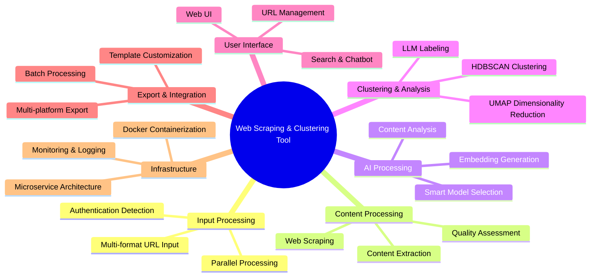

# Requirements Documentation

## Table of Contents
1. [System Overview](#system-overview)
2. [Functional Requirements](#functional-requirements)
3. [Non-Functional Requirements](#non-functional-requirements)
4. [Requirements Traceability Matrix](#requirements-traceability-matrix)

## System Overview

## Functional Requirements

### 1. URL Input and Processing

#### 1.1 Multi-format URL Input Support
**User Story:** As a user, I want to input URLs from various sources, so that I can process different types of URL collections efficiently.

**Acceptance Criteria:**
1. WHEN a user uploads a plain text file THEN the system SHALL parse URLs line by line
2. WHEN a user uploads a JSON file THEN the system SHALL extract URLs from structured data
3. WHEN a user uploads a CSV/Excel file THEN the system SHALL identify URL columns automatically
4. WHEN a user provides direct API input THEN the system SHALL accept URL arrays
5. WHEN a user submits web form input THEN the system SHALL parse URLs from text areas

#### 1.2 URL Validation and Enrichment
**User Story:** As a user, I want URLs to be validated and enriched with metadata, so that I can identify issues before processing.

**Acceptance Criteria:**
1. WHEN URLs are processed THEN the system SHALL validate URL format and accessibility
2. WHEN URLs are validated THEN the system SHALL extract domain, path, and parameter metadata
3. WHEN duplicate URLs are detected THEN the system SHALL provide deduplication options
4. WHEN URLs are categorized THEN the system SHALL provide preview functionality

### 2. Authentication Management

#### 2.1 Automatic Authentication Detection
**User Story:** As a user, I want the system to automatically detect authentication requirements, so that I don't have to manually configure each site.

**Acceptance Criteria:**
1. WHEN a website requires authentication THEN the system SHALL detect login requirements automatically
2. WHEN authentication is detected THEN the system SHALL classify the authentication method
3. WHEN authentication fails THEN the system SHALL provide clear error messages
4. WHEN authentication succeeds THEN the system SHALL store session data securely

#### 2.2 Secure Credential Storage
**User Story:** As a user, I want my credentials stored securely, so that my authentication information is protected.

**Acceptance Criteria:**
1. WHEN credentials are stored THEN the system SHALL use AES-256 encryption
2. WHEN credentials are accessed THEN the system SHALL require master key authentication
3. WHEN credentials are used THEN the system SHALL not expose them in logs or errors
4. WHEN domains are mapped THEN the system SHALL learn authentication patterns

### 3. Web Scraping and Content Extraction

#### 3.1 Intelligent Content Scraping
**User Story:** As a user, I want high-quality content extraction from web pages, so that I get clean, readable text for analysis.

**Acceptance Criteria:**
1. WHEN pages are scraped THEN the system SHALL extract main content using multiple methods
2. WHEN content is extracted THEN the system SHALL remove navigation, ads, and boilerplate
3. WHEN pages have authentication THEN the system SHALL use stored credentials automatically
4. WHEN scraping fails THEN the system SHALL retry with different extraction methods

#### 3.2 Respectful Scraping Practices
**User Story:** As a user, I want the system to scrape responsibly, so that I don't overload target websites.

**Acceptance Criteria:**
1. WHEN scraping websites THEN the system SHALL respect robots.txt files
2. WHEN making requests THEN the system SHALL implement configurable delays
3. WHEN rate limits are detected THEN the system SHALL back off automatically
4. WHEN duplicate content is found THEN the system SHALL skip redundant scraping

### 4. AI-Powered Content Analysis

#### 4.1 Configurable Model Selection
**User Story:** As a user, I want to choose AI models based on my hardware and quality needs, so that I get optimal performance.

**Acceptance Criteria:**
1. WHEN the system starts THEN it SHALL detect available hardware capabilities
2. WHEN models are recommended THEN the system SHALL consider task requirements and resources
3. WHEN models are selected THEN the system SHALL allow both automatic and manual selection
4. WHEN models fail THEN the system SHALL automatically fallback to alternative models

#### 4.2 Content Analysis and Embedding Generation
**User Story:** As a user, I want content analyzed and converted to embeddings, so that I can perform semantic clustering.

**Acceptance Criteria:**
1. WHEN content is analyzed THEN the system SHALL generate semantic embeddings
2. WHEN text is long THEN the system SHALL chunk content with overlap preservation
3. WHEN embeddings are generated THEN the system SHALL cache results for efficiency
4. WHEN analysis fails THEN the system SHALL retry with different models

### 5. Intelligent Clustering

#### 5.1 Semantic Content Clustering
**User Story:** As a user, I want content automatically grouped by semantic similarity, so that I can understand content themes.

**Acceptance Criteria:**
1. WHEN embeddings are available THEN the system SHALL perform dimensionality reduction using UMAP
2. WHEN dimensions are reduced THEN the system SHALL cluster using HDBSCAN
3. WHEN clusters are formed THEN the system SHALL generate quality metrics
4. WHEN clustering is poor THEN the system SHALL automatically adjust parameters

#### 5.2 Cluster Labeling and Visualization
**User Story:** As a user, I want clusters labeled with meaningful names and visualized, so that I can understand the groupings.

**Acceptance Criteria:**
1. WHEN clusters are formed THEN the system SHALL generate descriptive labels using LLMs
2. WHEN labels are created THEN the system SHALL provide cluster summaries
3. WHEN visualization is requested THEN the system SHALL generate 2D/3D plots
4. WHEN clusters evolve THEN the system SHALL track changes over time

### 6. Export and Integration

#### 6.1 Multi-Platform Export Support
**User Story:** As a user, I want to export results to my preferred platforms, so that I can integrate with my existing workflow.

**Acceptance Criteria:**
1. WHEN exporting to Notion THEN the system SHALL create structured database pages
2. WHEN exporting to Obsidian THEN the system SHALL generate markdown with internal links
3. WHEN exporting to Word THEN the system SHALL create formatted documents with visualizations
4. WHEN exporting to Markdown THEN the system SHALL include metadata frontmatter

#### 6.2 Customizable Export Templates
**User Story:** As a user, I want customizable export formats, so that I can tailor outputs to my specific needs.

**Acceptance Criteria:**
1. WHEN templates are used THEN the system SHALL support Jinja2 template engine
2. WHEN exports are customized THEN the system SHALL allow format modifications
3. WHEN large datasets are exported THEN the system SHALL support batch processing
4. WHEN exports fail THEN the system SHALL provide detailed error information

### 7. Session Management and Persistence

#### 7.1 Session-Based Data Organization
**User Story:** As a user, I want to organize my work in sessions, so that I can manage multiple projects separately.

**Acceptance Criteria:**
1. WHEN sessions are created THEN the system SHALL isolate data and configurations
2. WHEN sessions are managed THEN the system SHALL track metadata and model usage
3. WHEN sessions are backed up THEN the system SHALL include all configurations and data
4. WHEN sessions are restored THEN the system SHALL maintain full functionality

#### 7.2 Incremental Processing
**User Story:** As a user, I want to add new content to existing sessions, so that I can build upon previous work.

**Acceptance Criteria:**
1. WHEN new content is added THEN the system SHALL perform incremental clustering
2. WHEN sessions are compared THEN the system SHALL show evolution and changes
3. WHEN data is archived THEN the system SHALL maintain configurable retention policies
4. WHEN sessions are merged THEN the system SHALL handle model compatibility

## Non-Functional Requirements

### 8. Performance Requirements

#### 8.1 Processing Speed
- The system SHALL process 100+ URLs within 5 minutes on standard hardware
- The system SHALL support parallel processing of multiple URLs
- The system SHALL optimize resource usage based on available hardware

#### 8.2 Scalability
- The system SHALL support horizontal scaling through microservice architecture
- The system SHALL handle datasets with 10,000+ URLs
- The system SHALL maintain performance with growing data volumes

### 9. Security Requirements

#### 9.1 Data Protection
- The system SHALL encrypt all stored credentials using AES-256
- The system SHALL not expose sensitive information in logs or error messages
- The system SHALL implement secure session management

#### 9.2 Network Security
- The system SHALL isolate services using Docker networking
- The system SHALL implement service-to-service authentication
- The system SHALL provide secure API endpoints

### 10. Usability Requirements

#### 10.1 Ease of Use
- The system SHALL provide intuitive API endpoints
- The system SHALL offer comprehensive error messages and troubleshooting
- The system SHALL support both automatic and manual configuration modes

#### 10.2 Documentation and Support
- The system SHALL provide comprehensive API documentation
- The system SHALL include setup and configuration guides
- The system SHALL offer troubleshooting and FAQ resources

### 11. Reliability Requirements

#### 11.1 System Availability
- The system SHALL implement health checks for all services
- The system SHALL provide automatic service recovery mechanisms
- The system SHALL maintain data persistence across restarts

#### 11.2 Error Handling
- The system SHALL implement graceful degradation on component failures
- The system SHALL provide detailed error reporting and logging
- The system SHALL support automatic retry mechanisms with backoff

### 12. Compatibility Requirements

#### 12.1 Platform Support
- The system SHALL run on Linux, macOS, and Windows with Docker
- The system SHALL support various hardware configurations (CPU-only, GPU-enabled)
- The system SHALL be compatible with different resource constraints

#### 12.2 Model Compatibility
- The system SHALL support multiple LLM models (Qwen3, Phi4, Gemma3, Llama3.2, Mistral)
- The system SHALL support multiple embedding models (nomic-embed-text, all-minilm, mxbai-embed-large)
- The system SHALL handle model updates and migrations gracefully

## Additional Functional Requirements

### 13. Parallel Processing and Authentication Workflow
**User Story:** As a user, I want the system to scrape non-authenticated websites in parallel while handling authentication for protected sites, so that I can maximize efficiency.

**Acceptance Criteria:**
1. WHEN URLs are processed THEN the system SHALL separate authenticated and non-authenticated URLs into parallel processing queues
2. WHEN authentication is required THEN the system SHALL continue scraping other URLs while waiting for user authentication
3. WHEN authentication is completed THEN the system SHALL automatically resume scraping of authenticated URLs
4. WHEN parallel processing occurs THEN the system SHALL maintain proper resource allocation and rate limiting per domain

### 14. Smart LLM Model Selection and Management
**User Story:** As a user, I want an intelligent model selection system that automatically chooses optimal AI models based on my hardware and task requirements.

**Acceptance Criteria:**
1. WHEN the system initializes THEN it SHALL implement a smart LLM chooser that detects hardware capabilities
2. WHEN models are recommended THEN the system SHALL consider task type, resource constraints, and performance requirements
3. WHEN models are selected THEN the system SHALL support categories: Speed Optimized, Quality Optimized, Balanced, Multimodal, Multilingual, Code Focused
4. WHEN models are benchmarked THEN the system SHALL provide performance estimates and resource usage predictions

### 15. User Interface and URL Management
**User Story:** As a user, I want a comprehensive UI for managing URLs, searching content, and interacting with the system through a chatbot interface.

**Acceptance Criteria:**
1. WHEN managing URLs THEN the system SHALL provide UI capabilities to add, delete, edit, and organize URLs in collections
2. WHEN searching content THEN the system SHALL provide a search interface with semantic search, keyword search, and filtering options
3. WHEN interacting with the system THEN the system SHALL provide a chatbot interface for natural language queries about content and clusters
4. WHEN URLs are displayed THEN the system SHALL show status (pending, scraping, completed, failed, authentication required)

### 16. Containerized Testing and Development Workflow
**User Story:** As a developer, I want all testing and development to occur within Docker containers, so that I can ensure consistent environments and reproducible results.

**Acceptance Criteria:**
1. WHEN tests are executed THEN the system SHALL run all unit tests, integration tests, and end-to-end tests within Docker containers
2. WHEN development occurs THEN the system SHALL provide Docker-based development environments with hot reloading and debugging capabilities
3. WHEN services are tested THEN the system SHALL use Docker Compose for orchestrating test environments with proper service isolation
4. WHEN CI/CD is implemented THEN the system SHALL use containerized testing pipelines with proper test data management and cleanup

## Requirements Traceability Matrix

| Requirement ID | Category | Priority | Complexity | Dependencies | Test Coverage |
|---------------|----------|----------|------------|--------------|---------------|
| REQ-01 | Input Processing | High | Medium | None | Unit, Integration |
| REQ-02 | Authentication | High | High | REQ-01 | Unit, Integration, E2E |
| REQ-03 | Content Scraping | High | High | REQ-01, REQ-02 | Unit, Integration, E2E |
| REQ-04 | Model Management | High | High | None | Unit, Integration |
| REQ-05 | Content Analysis | High | High | REQ-04 | Unit, Integration |
| REQ-06 | Vector Storage | High | Medium | REQ-05 | Unit, Integration |
| REQ-07 | Clustering | High | High | REQ-05, REQ-06 | Unit, Integration |
| REQ-08 | Session Management | Medium | Medium | REQ-06 | Unit, Integration |
| REQ-09 | Export System | Medium | Medium | REQ-07 | Unit, Integration |
| REQ-10 | System Reliability | High | High | All | Integration, Load, E2E |
| REQ-11 | Performance | High | Medium | All | Performance, Load |
| REQ-12 | Security | High | High | All | Security, Penetration |
| REQ-13 | Parallel Processing | High | High | REQ-02, REQ-03 | Integration, E2E |
| REQ-14 | Smart Model Selection | High | High | REQ-04 | Unit, Integration |
| REQ-15 | User Interface | Medium | Medium | All | UI, E2E |
| REQ-16 | Containerization | High | Medium | All | Integration, E2E |

### Priority Legend
- **High**: Critical for system functionality
- **Medium**: Important for user experience
- **Low**: Nice-to-have features

### Complexity Legend
- **High**: Requires significant development effort and complex integration
- **Medium**: Moderate development effort with some integration challenges
- **Low**: Straightforward implementation with minimal dependencies