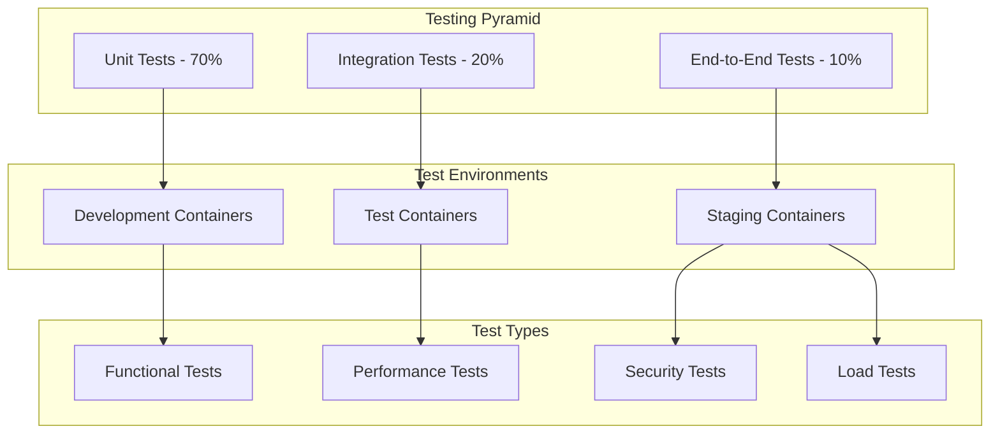

> ARCHIVED 2026-07-24 — superseded by the reviewed architecture plan (see docs/ARCHITECTURE_PLAN.md). Retained for reference.

# Development Guide

## Table of Contents
1. [Development Workflow](#development-workflow)
2. [Development Setup](#development-setup)
3. [Service Development Guidelines](#service-development-guidelines)
4. [Testing Strategy](#testing-strategy)
5. [Code Quality Standards](#code-quality-standards)
6. [Git Workflow](#git-workflow)
7. [Debugging and Troubleshooting](#debugging-and-troubleshooting)
8. [Contributing Guidelines](#contributing-guidelines)
9. [Deployment](#deployment)

## Development Workflow

### Key Development Principles
- **Container-First Development**: All development, testing, and deployment occurs within Docker containers
- **Microservice Architecture**: Independent, scalable services with clear boundaries (`backend-core`, `ai-engine`, `browser-engine`, `web-ui`)
- **Layered Module Context**: Start with [`MODULE_INDEX.md`](MODULE_INDEX.md), then the local `MODULE.md` card for the module/submodule you are changing
- **Test-Driven Development**: Each PR ships with the unit/integration/e2e suites green
- **Incremental Delivery**: Small, focused PRs over big-bang merges

For day-to-day status (open work, recent changes, what's shipped) read
`git log` and the PR queue rather than a doc — those are the authoritative
sources. The current open improvement list lives in
[`REPO_IMPROVEMENTS_REVIEW.md`](2026-07-24-REPO_IMPROVEMENTS_REVIEW.md) (archived alongside this doc).

## Development Setup

### Prerequisites
- Docker and Docker Compose
- Python 3.12+
- Git

### Local Development Environment

1. **Clone the repository**:
```bash
git clone <repository-url>
cd tab-organizer
```

2. **Set up environment**:
```bash
./scripts/init.py --provider ollama       # supported init flow: local or Docker Ollama
# or
./scripts/init.py --provider claude --claude-embedding-provider openrouter
# Anthropic Claude LLM with a separate embedding provider
# or
./scripts/cli.py init --build --models    # copy .env.example, build images, pull Ollama models
```

`scripts/init.py` accepts `ollama`, `claude`, `openrouter`, `claude_code`,
`codex_cli`, and `codex_acp`. For local subscription CLI providers, keep
embeddings on an embedding-capable provider and run the AI Engine on the host:

```bash
./scripts/init.py --provider codex_acp --subscription-embedding-provider ollama
./scripts/cli.py host-ai --provider codex_acp
./scripts/cli.py start --dev -d --host-ai
```

3. **Start development services**:
```bash
./scripts/cli.py start --dev -d
```

4. **Run tests**:
```bash
./scripts/cli.py test --type unit
```

For focused module iteration, prefer the nearest local target before the full
pipeline: `make test-backend`, `make test-ai`, `make test-browser`,
`make test-web`, or `make test-ops`.

## Service Development Guidelines

Before editing an existing service or submodule, read its local `MODULE.md`.
Update that card in the same change when boundaries, connected modules, stub
classifications, validation commands, or docs alignment rules change.

### Creating a New Service

1. **Create service directory**:
```bash
mkdir services/new-service
cd services/new-service
```

2. **Create basic structure**:
```
services/new-service/
├── main.py              # FastAPI application
├── requirements.txt     # Python dependencies
├── Dockerfile          # Container configuration
├── test_*.py           # Unit tests
└── README.md           # Service documentation
```

3. **Implement FastAPI service**:
```python
from fastapi import FastAPI
import structlog

logger = structlog.get_logger()
app = FastAPI(title="New Service", version="1.0.0")

@app.get("/health")
async def health_check():
    return {"status": "healthy", "service": "new-service"}
```

4. **Add to Docker Compose**:
```yaml
new-service:
  build:
    context: ./services/new-service
  ports:
    - "808X:808X"
  networks:
    - tab-organizer-network
  profiles: [default, dev]
```

## Testing Strategy

### Containerized Testing Framework



### Test Coverage Requirements

| Service | Unit Tests | Integration Tests | E2E Tests | Performance Tests |
|---------|------------|-------------------|-----------|-------------------|
| Backend Core | 95% | Yes | Yes | Yes |
| URL Input | 90% | Yes | Yes | No |
| Platform accounts/API tokens | 90% | Yes | Yes | No |
| Web Scraper | 90% | Yes | Yes | Yes |
| AI Engine/RAG | 90% | Yes | Yes | Yes |
| Clustering | 85% | Yes | Yes | Yes |
| Export | 85% | Yes | Yes | No |
| Session Manager | 90% | Yes | Yes | No |
| Provider/runtime config | 95% | Yes | Yes | Yes |
| Web UI | 80% | Yes | Yes | Yes |

### Automated Testing Pipeline

The unified `docker-compose.yml` exposes dedicated profiles for every test stage:

- `test-unit` — runs `pytest tests/unit` with coverage in an isolated container.
- `test-integration` — runs `pytest tests/integration` against the live `default` stack (Ollama + backend-core + ai-engine + browser-engine).
- `test-e2e` — runs `pytest tests/e2e` against the full stack including `web-ui`.

Use `./scripts/cli.py test --type {unit,integration,e2e}` (the wrapper that CI uses) or invoke `docker compose --profile <name> up ...` directly. Locust scenarios live under `tests/load/` and are driven manually — there is no `test-performance` profile yet.

#### Unit Tests
- **Framework**: pytest with async support running in dedicated test containers
- **Coverage Target**: 85-95% depending on service criticality
- **Container Setup**: Each service has its own test container with isolated test databases
- **Test Categories**:
  - Model validation and serialization
  - Business logic and algorithms
  - Smart LLM chooser functionality
  - Parallel processing coordination
  - Authentication workflow testing

#### Integration Tests
- **Service Communication**: Test inter-service APIs using Docker Compose test networks
- **Database Operations**: Test data persistence and retrieval with containerized test databases
- **External Dependencies**: Test the AI Engine's embedded LanceDB and Ollama integration in isolated container environments
- **End-to-End Workflows**: Complete user journeys tested across containerized services
- **Parallel Processing**: Test authentication and scraping workflows in parallel container environments

#### Performance Tests
- **Load Testing**: Concurrent user simulation using containerized load testing tools
- **Stress Testing**: Resource limit validation within container constraints
- **Benchmark Testing**: Algorithm performance measurement in standardized container environments
- **Memory Testing**: Container memory usage and leak detection
- **Model Performance**: Benchmarking of different AI models within container resource limits

#### Example Test Structure:
```python
import pytest
from main import URLValidator, URLParser, SmartModelChooser

class TestURLValidator:
    def test_valid_urls(self):
        valid_urls = ["https://example.com", "http://test.org"]
        for url in valid_urls:
            assert URLValidator.is_valid_url(url)
    
    def test_invalid_urls(self):
        invalid_urls = ["not-a-url", "ftp://example.com"]
        for url in invalid_urls:
            assert not URLValidator.is_valid_url(url)

class TestSmartModelChooser:
    def test_hardware_detection(self):
        chooser = SmartModelChooser()
        hardware = chooser.detect_hardware()
        assert "cpu" in hardware
        assert "memory" in hardware
        assert "gpu" in hardware
    
    def test_model_recommendation(self):
        chooser = SmartModelChooser()
        recommendation = chooser.recommend_model(
            task_type="reasoning",
            priority="balanced",
            hardware_constraints={"memory": "8GB"}
        )
        assert recommendation["llm_model"] is not None
        assert recommendation["embedding_model"] is not None
        assert len(recommendation["fallback_chain"]) > 0

class TestParallelProcessing:
    @pytest.mark.asyncio
    async def test_parallel_authentication_workflow(self):
        urls = [
            "https://public-site.com",
            "https://auth-required-site.com"
        ]
        processor = ParallelURLProcessor()
        results = await processor.process_urls(urls)
        
        assert len(results["public_queue"]) == 1
        assert len(results["auth_queue"]) == 1
        assert results["processing_time"] < 300  # 5 minutes max
```

### Code Quality Standards

#### Python Code Style
- Follow PEP 8 style guidelines
- Use type hints for function parameters and returns
- Include docstrings for all public functions
- Use meaningful variable and function names

#### Error Handling
- Use structured logging with correlation IDs
- Implement graceful degradation
- Provide clear error messages
- Don't expose sensitive information in errors

#### Example Error Handling:
```python
import structlog

logger = structlog.get_logger()

try:
    result = process_urls(urls)
    logger.info("URLs processed successfully", count=len(result))
    return result
except ValidationError as e:
    logger.error("URL validation failed", error=str(e))
    raise HTTPException(status_code=400, detail="Invalid URL format")
except Exception as e:
    logger.error("Unexpected error", error=str(e))
    raise HTTPException(status_code=500, detail="Internal server error")
```

## Git Workflow

### Commit Message Format
Follow conventional commit format:
```
type(scope): description

feat(url-input): add csv file upload support
fix(scraper): handle authentication timeout
docs(readme): update installation instructions
test(analyzer): add unit tests for embedding generation
```

### Branch Strategy
- `main`: Production-ready code
- `develop`: Integration branch for features
- `feature/task-name`: Individual task implementation
- `hotfix/issue-name`: Critical bug fixes

### Commit Guidelines
- Make atomic commits (one logical change per commit)
- Include tests with feature commits
- Update documentation when needed
- Reference issue numbers when applicable

## Debugging and Troubleshooting

### Service Logs
```bash
# View all service logs
./scripts/cli.py logs

# View specific service logs
./scripts/cli.py logs --follow ai-engine

# Follow logs in real-time
docker compose logs -f ai-engine
```

### Health Checks
```bash
curl http://localhost:8080/health   # backend-core
curl http://localhost:8090/health   # ai-engine (also reports LanceDB readiness)
curl http://localhost:8083/health   # browser-engine
curl http://localhost:11434/        # ollama
```

### Common Issues

#### Service Won't Start
1. Check Docker Compose configuration
2. Verify port conflicts
3. Check service dependencies
4. Review service logs for errors

#### Tests Failing
1. Ensure test environment is clean
2. Check test data and fixtures
3. Verify mock configurations
4. Run tests in isolation

#### Performance Issues
1. Monitor resource usage
2. Check model configurations
3. Review caching strategies
4. Optimize database queries

## Contributing Guidelines

### Before Starting Development
1. Check existing issues and tasks
2. Discuss major changes in issues
3. Follow the established architecture
4. Write tests for new functionality

### Pull Request Process
1. Create feature branch from develop
2. Implement changes with tests
3. Update documentation if needed
4. Ensure all tests pass
5. Submit pull request with clear description

### Code Review Checklist
- [ ] Code follows style guidelines
- [ ] Tests are included and passing
- [ ] Documentation is updated
- [ ] Error handling is appropriate
- [ ] Performance considerations addressed
- [ ] Security implications reviewed

## Deployment

### Development Deployment
```bash
# Start all services (dev profile, hot-reload friendly)
./scripts/cli.py start --dev -d

# Stop all services
./scripts/cli.py stop

# Restart a specific service
docker compose restart ai-engine
```

### Production Considerations
- Use production Docker Compose configuration
- Implement proper backup strategies
- Set up monitoring and alerting
- Configure log aggregation
- Plan for model updates and migrations

## Quality Gates

### Definition of Done
Each task is considered complete when:
- [ ] All code is containerized and runs in Docker
- [ ] Unit test coverage meets minimum requirements (85-95%)
- [ ] Integration tests pass in containerized environment
- [ ] Code review completed and approved
- [ ] Documentation updated (API docs, README, etc.)
- [ ] Performance benchmarks meet requirements
- [ ] Security scan passes without critical issues
- [ ] Monitoring and logging implemented
- [ ] Deployment to staging environment successful

### Code Quality Standards
- **Code Coverage**: Minimum 85% for critical services, 80% for UI components
- **Performance**: API response times < 2 seconds, batch processing < 5 minutes for 100 URLs
- **Security**: No critical or high-severity vulnerabilities
- **Documentation**: All public APIs documented with OpenAPI/Swagger
- **Containerization**: All services must run in Docker with proper health checks

### Continuous Integration Pipeline

```yaml
# .github/workflows/ci.yml
name: CI/CD Pipeline
on: [push, pull_request]

jobs:
  test:
    runs-on: ubuntu-latest
    steps:
      - uses: actions/checkout@v3
      - name: Run unit tests
        run: ./scripts/cli.py test --type unit
      - name: Run integration tests
        run: ./scripts/cli.py test --type integration
      - name: Run e2e tests
        run: ./scripts/cli.py test --type e2e
      - name: Upload coverage to Codecov
        uses: codecov/codecov-action@v3

  security:
    runs-on: ubuntu-latest
    steps:
      - uses: actions/checkout@v3
      - name: Run security scan
        run: docker run --rm -v $(pwd):/app securecodewarrior/docker-security-scan
      - name: Run dependency check
        run: docker run --rm -v $(pwd):/app owasp/dependency-check

```

The current pipeline lives in [`.github/workflows/ci-cd.yml`](../.github/workflows/ci-cd.yml) — refer to it for the authoritative job definitions.

## Risk Management

### Current Risks and Mitigation Strategies

| Risk | Impact | Probability | Mitigation Strategy |
|------|--------|-------------|-------------------|
| Parallel authentication complexity | High | Medium | Incremental implementation with extensive testing |
| Model management hot-swapping | Medium | Low | Comprehensive fallback chains and monitoring |
| Container resource constraints | Medium | Medium | Hardware detection and automatic scaling |
| Integration testing complexity | Medium | High | Isolated test environments and mock services |
| Performance degradation | High | Low | Continuous benchmarking and optimization |

## Resources

### Documentation
- [FastAPI Documentation](https://fastapi.tiangolo.com/)
- [Docker Compose Reference](https://docs.docker.com/compose/)
- [LanceDB Documentation](https://lancedb.github.io/lancedb/)
- [Ollama Documentation](https://ollama.ai/docs/)
- [UMAP Documentation](https://umap-learn.readthedocs.io/)
- [HDBSCAN Documentation](https://hdbscan.readthedocs.io/)

### Tools and Libraries
- **Web Framework**: FastAPI
- **Testing**: pytest, pytest-asyncio, pytest-cov
- **Logging**: structlog
- **Containerization**: Docker, Docker Compose
- **Vector Database**: LanceDB (embedded)
- **AI Models**: Ollama
- **Clustering**: UMAP, HDBSCAN, scikit-learn
- **Web Scraping**: Scrapy, Beautiful Soup, trafilatura
- **Authentication**: Selenium, Playwright
- **Export**: Jinja2, python-docx, notion-client

### Development Tools
- **Code Quality**: black, flake8, mypy
- **Security**: bandit, safety
- **Performance**: locust, pytest-benchmark
- **Monitoring**: Prometheus, Grafana
- **Documentation**: Sphinx, mkdocs
