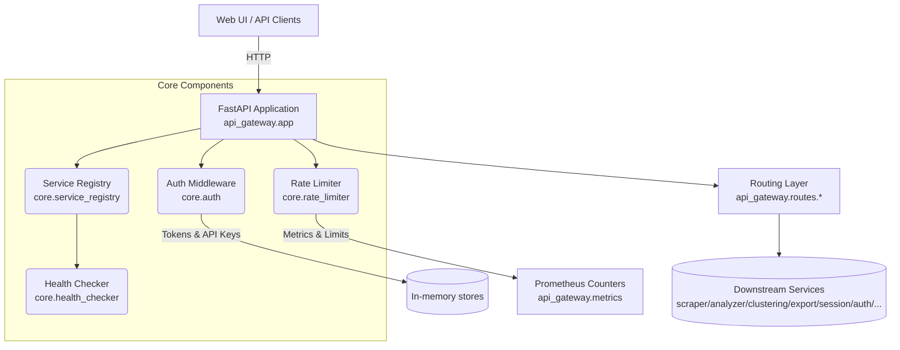

# API Gateway Service

## Overview
The API Gateway acts as the orchestration entry point for the web scraping and clustering platform. It terminates HTTP requests, authenticates users, applies rate limiting, brokers communication with downstream microservices, and exposes health and observability endpoints required by the web UI and automation pipelines.

## Architecture


Key files:
- `api_gateway/app.py` – application factory, lifecycle management, router registration.
- `api_gateway/core/` – reusable infrastructure components (settings, logging, auth, registry, rate limiting, health).
- `api_gateway/routes/` – modular endpoint definitions grouped by responsibility.
- `api_gateway/middleware.py` – request metrics, structured logging, and rate limiting middleware.
- `api_gateway/state.py` – dataclass container that wires dependencies for the FastAPI app.
- `main.py` – compatibility shim re-exporting `app`, `create_app`, and core building blocks.

## Setup
1. Ensure you are in the project root and create the virtual environment of your choice.
2. Install dependencies:
   ```bash
   cd services/api-gateway
   pip install -r requirements.txt
   ```
3. (Optional) Copy `.env.example` to `.env` and adjust service URLs, credentials, and rate limiting defaults if overrides are needed.

## Configuration
Runtime configuration lives in `api_gateway/core/config.py` (`Settings` class). Most values can be overridden with environment variables:
- `ENVIRONMENT` – switches behaviour for dev/test/prod environments (set to `test` or set `ENABLE_BACKGROUND_TASKS=false` for faster local iteration).
- `LOG_LEVEL`, `LOG_FORMAT`, `LOG_FILE` – logging controls.
- `OLLAMA_URL`, `QDRANT_URL` – external dependency endpoints.
- `SERVICES__<service_name>__url` – configure downstream service targets using Pydantic nested settings.
- `ENABLE_BACKGROUND_TASKS` – disable background health checks/cleanup when running in unit tests.

## Testing
From `services/api-gateway`:
```bash
python -m pytest
```
The integration tests spin up an in-memory FastAPI app with lightweight doubles for service registry and health checker components. Rate-limiting behaviour and proxying are validated with patched `httpx.AsyncClient` calls.

To make a quick smoke check without pytest:
```python
from fastapi.testclient import TestClient
from api_gateway.app import create_app

app = create_app()
with TestClient(app) as client:
    print(client.get("/").json()["status"])
```
The snippet instantiates the gateway with default settings and verifies that the root endpoint responds successfully.

## Development Tips
- Use `create_app(Settings(...))` to spin up customised app instances with preconfigured settings for local experiments or tests.
- All long-lived components are attached to `app.state.gateway_state`; this makes it easy to swap in fakes or mocks in tests without touching global modules.
- Enable structured JSON logging by default; during local debugging set `LOG_FORMAT=console` for human-readable output.
- Background tasks (health monitoring and auth cleanup) rely on `enable_background_tasks`; disable them in tight development loops to avoid noisy logs.
- When adding new routes, prefer defining them inside `api_gateway/routes/` and include the router in `api_gateway/routes/__init__.py` to keep the surface area organised.
