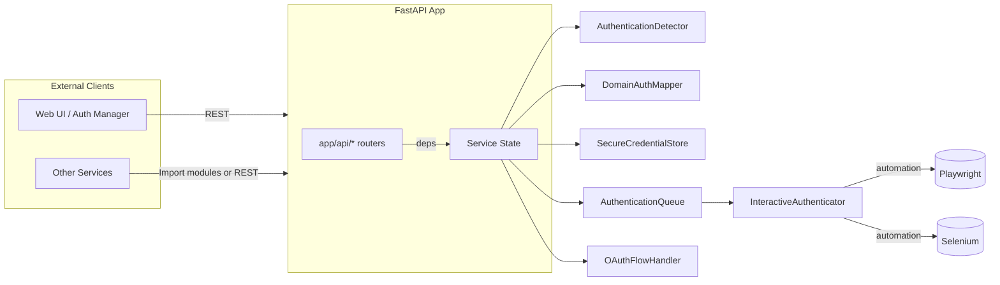

# Authentication Service

This service centralizes detection, credential storage, and interactive sign‑in workflows for domains that require authentication before scraping. It is built on top of **FastAPI** and splits responsibilities into composable modules so that other services can re‑use the detector, credential vault, or queue directly.

## Highlights
- Detection engine that scores responses and classifies auth methods (form, OAuth, basic, captcha).
- In‑memory credential locker with Fernet encryption for quick experiments.
- Browser automation helpers powered by **Playwright** and **Selenium** for interactive login flows.
- Background authentication queue that runs concurrent login tasks and tracks results.
- REST API that exposes detection, credential management, session lifecycle, and queue status.

## Architecture Overview



The `AuthServiceState` factory (see `app/state.py`) wires these components together, ensuring a single queue, mapper, and detector instance are shared across API requests.

## Project Structure

```
services/auth/
├── app/
│   ├── api/              # FastAPI routers grouped by concern
│   ├── auth_queue.py     # Background worker queue
│   ├── credential_store.py
│   ├── detector.py
│   ├── domain_mapper.py
│   ├── interactive.py    # Playwright/Selenium flows
│   ├── logging.py
│   ├── models.py         # Dataclasses + Pydantic schemas
│   ├── oauth.py
│   ├── state.py          # Shared singleton wiring
│   └── dependencies.py   # FastAPI dependency helpers
├── main.py               # FastAPI entrypoint (supports script & uvicorn)
├── requirements.txt
└── tests/                # Unit & integration test suites
```

### API Routers (`app/api`)

| Router | Purpose |
|--------|---------|
| `status.py` | Health and root endpoints |
| `detection.py` | `/api/auth/detect` for scoring auth requirements |
| `credentials.py` | CRUD operations for stored credentials |
| `domains.py` | Domain mapping overview and manual adjustments |
| `interactive.py` | Queue interactive login tasks |
| `sessions.py` | Inspect / renew / invalidate stored sessions |
| `queue.py` | Queue monitoring endpoint |

## Getting Started

### 1. Python Environment

Greenlet and Playwright currently require Python ≤ 3.12, so create a 3.12 virtual environment:

```bash
python3.12 -m venv .venv
source .venv/bin/activate
pip install -r services/auth/requirements.txt
```

Optional (for real browsers):

```bash
playwright install chromium firefox
```

### 2. Run the API

```bash
uvicorn services.auth.main:app --reload
```

The service will be available at `http://127.0.0.1:8000`. Auto‑reload watches the repository root by default.

### 3. Explore Endpoints

- Swagger UI: `http://127.0.0.1:8000/docs`
- Health Check: `GET /health`
- Detect auth: `POST /api/auth/detect`
- Store credentials: `POST /api/auth/store-credentials`
- Trigger interactive login: `POST /api/auth/interactive`
- Monitor queue: `GET /api/auth/queue/status`

See `services/web-ui/src/pages/AuthManager.js` for example client calls.

## UI Integration Guide

> The web UI will be updated after the service refactor. The contract below documents how the front end should interact with the authentication service once it migrates.

### Base Path (via API Gateway)

- `POST /api/auth/detect` – score a URL or HTML response for authentication requirements.
- `POST /api/auth/store-credentials` – persist encrypted credentials for a domain.
- `GET  /api/auth/credentials/{domain}` – fetch stored credential metadata.
- `DELETE /api/auth/credentials/{domain}` – remove stored credentials.
- `POST /api/auth/interactive` – enqueue an interactive login task (Playwright/Selenium automation).
- `GET  /api/auth/queue/status` – monitor queue depth and active tasks.
- `POST /api/auth/session/{sessionId}/renew` / `DELETE /api/auth/session/{sessionId}` – manage reusable authenticated sessions.

### Sample Payloads

**Detect authentication**
```json
POST /api/auth/detect
{
  "url": "https://example.com/protected",
  "status_code": 401,
  "headers": {"www-authenticate": "Basic realm=\\"Protected\\""},
  "response_content": "<html>...</html>"
}
```

Response:
```json
{
  "requires_auth": true,
  "detected_method": "basic",
  "detection_confidence": 0.92,
  "auth_indicators": ["HTTP 401 status code", "WWW-Authenticate header"],
  "domain": "example.com"
}
```

**Store credentials**
```json
POST /api/auth/store-credentials
{
  "domain": "example.com",
  "credentials": {"username": "demo", "password": "secret"},
  "auth_method": "form",
  "login_url": "https://example.com/login"
}
```

### Front-end Notes

- Always provide the session or domain context so the mapper can tie credentials to scraping jobs.
- The interactive queue endpoints (`/interactive`, `/queue/status`) should back any UI features that trigger human-like login flows.
- The UI can poll `/api/auth/credentials/{domain}` after storing credentials to confirm they were persisted.
- When credentials are removed, consider also calling the session invalidation endpoints to keep caches in sync.

## Docker

The included Dockerfile builds a minimal Python 3.11 image and runs the service
under Uvicorn on port **8000**:

```bash
docker build -t auth services/auth
docker run --rm -p 8000:8000 auth
```

A health check hits `GET /health`, mirroring how the API Gateway monitors the
container in docker-compose. No changes were required after the refactor—the
entrypoint still uses `uvicorn main:app`, and `main.py` re-exports all public
symbols so imports in tests or other services continue to work.

## Testing

From the repository root (with the virtualenv activated):

```bash
pytest services/auth/tests
```

The unit suite covers detection and credential storage; integration tests validate the interactive queue and automation adapters (mocks for Playwright/Selenium are used, so real browsers are not required).

## Extending the Service

- **Swap credential backend:** Implement a new store class (e.g. backed by a database or Hashicorp Vault) following the `SecureCredentialStore` interface and swap it during state construction.
- **Add providers:** Extend `InteractiveAuthenticator` with provider‑specific logic or add new tasks to the queue for MFA/captcha handling.
- **Reuse detector:** Import `AuthenticationDetector` and `DomainAuthMapper` directly in other services for synchronous detection without HTTP calls.

For significant changes, update the diagram above to reflect new dependencies so downstream teams can track responsibilities at a glance.
