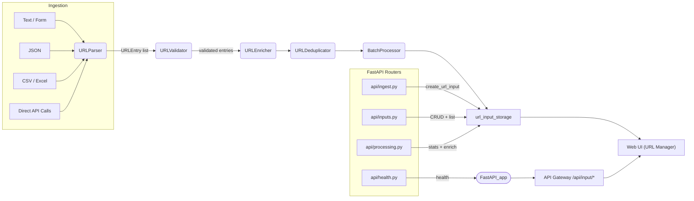

# URL Input Service

This service ingests URLs from multiple sources (text, JSON, CSV, Excel, direct API
calls, and form submissions), validates them, enriches them with metadata, and
exposes management endpoints that power the tab organizer web UI.

## Architecture Overview



The ingestion flow normalises input into `URLEntry` objects, validates and
enriches them, deduplicates overlapping URLs, and persists results inside the
in-memory storage abstraction. Every stored batch is associated with a
`session_id` sourced from the Session service so downstream scraping, analysis
and export can isolate workspace data. FastAPI routers expose upload,
management, and analytics surfaces that the API Gateway and web UI consume.

## Codebase Architecture

```
services/url-input
├── main.py                 # FastAPI entrypoint (imports router + re-exports legacy symbols)
├── requirements.txt
├── README.md
└── app
    ├── __init__.py         # Package exports for service modules
    ├── logging.py          # structlog setup helpers
    ├── models.py           # URLMetadata, URLEntry, URLInput dataclasses
    ├── utils.py            # Identifier helpers (ensure_entry_ids, parsing)
    ├── validators.py       # URLValidator for format checks
    ├── detector.py         # InputFormatDetector
    ├── parser.py           # URLParser (text/json/csv/excel ingestion)
    ├── enrichment.py       # URLEnricher for metadata + categorisation
    ├── deduplication.py    # URLDeduplicator utilities
    ├── batching.py         # BatchProcessor stats + enrichment
    ├── storage.py          # In-memory URLInput storage abstraction
    ├── services
    │   └── input_manager.py  # create_url_input helper built on storage
    └── api
        ├── __init__.py     # Router assembly
        ├── health.py       # /health + /
        ├── inputs.py       # CRUD + listing endpoints
        ├── ingest.py       # Upload + direct submission endpoints
        ├── processing.py   # Enrichment, duplicates, preview, validation
        └── dependencies.py # Shared dependency helpers
```

All web-facing routes are defined under `app/api`, while supporting business
logic is grouped into focused modules. `main.py` simply configures logging,
instantiates the FastAPI app, and includes the assembled router. This layout
mirrors how other services in the monorepo are organised, making it easier to
extend or swap out pieces (for example, replacing the in-memory storage layer).

## UI Integration Guide

The React front end (`services/web-ui/src/services/api.js`) consumes the
following endpoints, all still available under the API Gateway prefix `/api`.
Each call must provide a `session_id` (query parameter for JSON endpoints,
form field for file uploads) to scope operations to the active workspace:

- `POST /api/input/urls` – validate a single URL or small list.
- `POST /api/input/upload/{text|json|csv|excel}` – upload URL collections.
- `POST /api/input/upload` – upload a file with automatic format detection (txt/json/csv/tsv/excel).
- `GET /api/input` – list stored URL batches.
- `GET /api/input/{input_id}` – fetch metadata and URL rows for a batch.
- `DELETE /api/input/{input_id}` / `DELETE /api/input/{input_id}:{entry_id}` –
  remove batches or individual URLs.
- `PUT /api/input/{input_id}:{entry_id}` – update notes, category, or status for
  a URL entry.
- `GET /api/input/list` – flattened list used to populate tables.
- `GET /api/input/preview/{input_id}` – preview with filtering support.

Additional processing routes such as `/api/input/enrich/{input_id}` and
`/api/input/duplicates/{input_id}` remain available for future UI affordances.

## Running Locally

1. Install dependencies:

   ```bash
   pip install -r services/url-input/requirements.txt
   ```

2. Start the service (standalone):

   ```bash
   python services/url-input/main.py
   ```

   This launches FastAPI on `http://localhost:8001`. When running inside the
   docker-compose stack, the API Gateway proxies the service under
   `http://localhost:8080/api/input/*`.

3. Run the web UI against the service (from `services/web-ui`):

   ```bash
   npm install
   npm start
   ```

   Make sure `REACT_APP_API_URL` points to the API Gateway (defaults to
   `http://localhost:8080`). Uploading URLs, validating entries, and viewing
   lists should all hit the refactored endpoints transparently.

### Session service integration

- Set the `SESSION_SERVICE_URL` environment variable if the Session service is
  exposed under a non-default hostname. It defaults to
  `http://session-service:8087` inside docker-compose. When ingestion stores a
  new batch, the service automatically increments the session's URL counters via
  `PUT /sessions/{session_id}/stats`.

## Docker

The included Dockerfile builds a minimal Python 3.11 image and runs the service
under Uvicorn on port **8081**:

```bash
docker build -t url-input-service services/url-input
docker run --rm -p 8081:8081 url-input-service
```

A health check hits `GET /health`, mirroring how the API Gateway monitors the
container in docker-compose. No changes were required after the refactor—the
entrypoint still uses `uvicorn main:app`, and `main.py` re-exports all public
symbols so imports in tests or other services continue to work.

## Tests

- Unit tests target the new modular helpers:

  ```bash
  PYTHONPATH=services/url-input pytest --override-ini addopts='' services/url-input/tests/unit
  ```

- Integration tests exercise the FastAPI routes using `TestClient`:

  ```bash
  PYTHONPATH=services/url-input pytest --override-ini addopts='' services/url-input/tests/integration
  ```

Adding the service path to `PYTHONPATH` mirrors the runtime import behaviour so
that `from main import ...` statements in the tests continue to work.

## Summary of Recent Refactor

- Broke the monolithic `main.py` into dedicated modules under `app/`, covering
  validation, parsing, enrichment, deduplication, batching, and storage.
- Introduced `app/api` routers grouped by responsibility (`health`, `inputs`,
  `ingest`, `processing`), which keeps endpoint code focused and reusable.
- Added a lightweight service layer (`app/services/input_manager.py`) that
  centralises URL input creation on top of the storage abstraction.
- Maintained backwards compatibility for imports (`url_inputs`, `URLParser`,
  etc.) by re-exporting them from the new `main.py`.
- Documented the architecture and test commands so onboarding new contributors
  is simpler, and to clarify how the web UI interacts with these endpoints.
