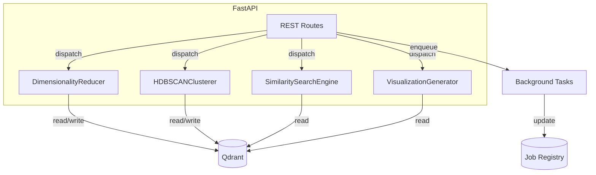

# Clustering Service

The clustering service groups related documents and generates interactive visualisations and recommendations on top of Qdrant-stored embeddings. It exposes a FastAPI application that orchestrates UMAP dimensionality reduction, HDBSCAN clustering, and similarity search workloads.

## Architecture



### Module layout

- `app/config.py` – environment-driven constants (Qdrant host/port, executor sizing).
- `app/logging.py` – structlog configuration shared across the service.
- `app/executor.py` – thread pool used for CPU-bound offloading.
- `app/clients/qdrant.py` – Qdrant client bootstrap.
- `app/models.py` – Pydantic request/response schemas.
- `app/umap.py` – `ModelAwareUMAPConfig` and `DimensionalityReducer`.
- `app/hdbscan_service.py` – clustering implementation and metrics helpers.
- `app/similarity.py` – similarity search and recommendation engine.
- `app/visualization.py` – Plotly visualisation builder.
- `app/background/tasks.py` – background UMAP/HDBSCAN task runners.
- `app/routes.py` – FastAPI endpoint implementations.
- `app/state.py` – shared singleton instances (`active_jobs`, reducer, clusterer, etc.).
- `main.py` – compatibility layer that re-exports public symbols and registers `sys.modules["main"]`.

### Service integrations

- The API Gateway routes clustering traffic to the FastAPI app mounted at `services.clustering.main:app`. Endpoints such as `/umap/reduce`, `/hdbscan/cluster`, `/similarity/search`, and `/recommendations/content-based` mirror the previous interface so existing gateway wiring continues to function.
- The web UI expects pre-computed clustering jobs and visualisations; the `/visualize/create` route still returns rich Plotly HTML that the front-end can embed directly.
- Other microservices (scraper, session manager) interact with clustering through Qdrant payload fields (`cluster_id`, `reduced_embedding`, recommendation metadata). The new package keeps Qdrant usage encapsulated in `app/background` and `app/similarity`.

## UI Integration Guide

> The UI will be updated after the API work is complete. This section documents the contract the React app (or any client) should use once it switches over.

### Base Path

When the API Gateway is in front of the service, the UI should issue requests to:

- `POST /api/clustering-service/umap/reduce`
- `POST /api/clustering-service/hdbscan/cluster`
- `GET  /api/clustering-service/clusters/{sessionId}`
- `GET  /api/clustering-service/clusters/details/{clusterId}?session_id={sessionId}`
- `GET  /api/clustering-service/clusters/{sessionId}/visualize`
- `POST /api/clustering-service/similarity/search`
- `POST /api/clustering-service/recommendations/content-based`

All endpoints accept/return JSON. The gateway simply forwards the call to the FastAPI router defined in `services/clustering/app/routes.py`.

### Typical UI Flow

1. **List clusters for a session**  
   ```http
   GET /api/clustering-service/clusters/{sessionId}
   ```
   Response:
   ```json
   [
     {
       "id": 3,
       "label": "Cluster 3",
       "size": 42,
       "average_quality": 0.76,
       "embedding_models": ["nomic-embed-text"],
       "timestamp_range": {"min": 1728459123, "max": 1728461020},
       "sample_titles": ["Doc A", "Doc B"]
     },
     { "id": -1, "label": "Noise", "size": 5, ... }
   ]
   ```
   Use this to populate filters or summary cards.

2. **Drill into a cluster**  
   ```http
   GET /api/clustering-service/clusters/details/3?session_id={sessionId}&limit=100
   ```
   Response contains `items` with URL, title, optional `reduced_embedding`, metadata, etc., suitable for list/detail views.

3. **Render visualisations**  
   ```http
   GET /api/clustering-service/clusters/{sessionId}/visualize?type=2d&color_by=cluster
   ```
   Response:
   ```json
   {
     "plot_html": "<html>…Plotly snippet…</html>",
     "color_by": "cluster",
     "n_points": 100,
     "performance_metrics": { ... }
   }
   ```
   The UI should inject `plot_html` directly into an iframe or dangerous HTML container.

4. **Similarity & recommendations** (optional in UI v1)  
   - `POST /api/clustering-service/similarity/search` with `query_embedding` or `query_text`.  
   - `POST /api/clustering-service/recommendations/content-based` with user interactions.  
   Responses include ranked items plus metadata for display.

### Payload Cheatsheet

- `UMAPRequest` (reduce embeddings): see `services/clustering/app/models.py`.
- `HDBSCANRequest` (cluster embeddings): same file – UI usually sets `session_id`, `auto_optimize`, `use_reduced_embeddings`.
- `SimilaritySearchRequest`: either a `query_embedding` array or (future enhancement) a `query_text`.
- `RecommendationRequest`: historical interactions for personalised suggestions.

### Notes for Front-end Developers

- All responses include numeric IDs and timestamps that the UI can cache or paginate.
- Cluster IDs of `-1` represent “noise” points; handle them separately in visualisations.
- When requesting visualisations, use `type=3d` only if the UI surface actually supports a 3D Plotly embed.
- You can detect processing progress via `/api/clustering-service/hdbscan/status/{jobId}` and `/api/clustering-service/performance/metrics/{jobId}` if you choose to expose async job tracking in the UI.
- The legacy endpoints exposed under `main.py` remain available, but new UI code should rely on the REST API described above for clarity and forward compatibility.

## Setup

1. **Install dependencies**
   ```bash
   pip install -r services/clustering/requirements.txt
   ```
2. **Environment configuration**
   - `QDRANT_HOST` (default `qdrant`)
   - `QDRANT_PORT` (default `6333`)
   - `CLUSTERING_MAX_WORKERS` thread pool size (default `4`)
   - `CLUSTERING_QDRANT_SCROLL_LIMIT` pagination size for scroll operations (default `10000`)

3. **Run the service**
   ```bash
   uvicorn services.clustering.main:app --host 0.0.0.0 --port 8085
   ```

## Testing

```bash
python -m pytest services/clustering/tests
```

The test suite covers dimensionality reduction, clustering metrics, and similarity/recommendation flows. Compatibility checks ensure `main.executor` continues to point at the shared executor for existing mocks.

## Development Tips

- Prefer importing from `services.clustering.app.*` modules; `services/clustering/main.py` is kept only for backwards compatibility with legacy scripts and tests.
- When patching shared singletons (e.g., the executor or Qdrant client) in tests, target the module where they are consumed (`services.clustering.app.umap.executor`, `services.clustering.app.similarity.qdrant_client`, etc.).
- Large background jobs should update `active_jobs` with status and metrics to surface progress through the API.
- Keep UMAP/HDBSCAN tuning inside their dedicated modules so API routes remain thin orchestration layers.
