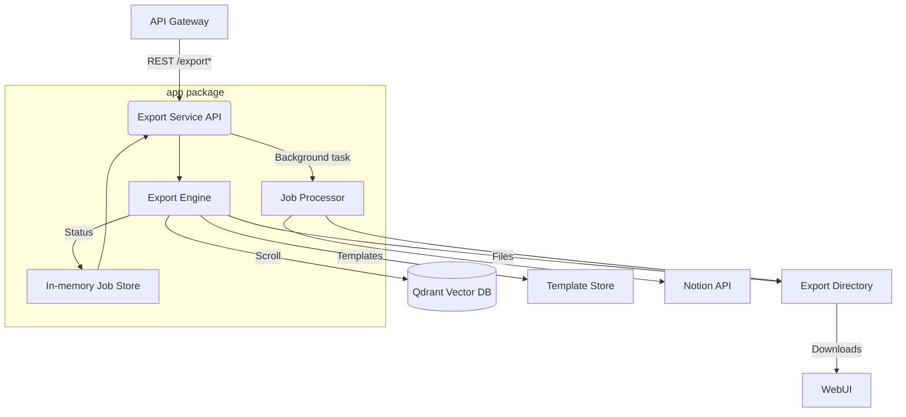

# Export Service

The export service exposes a FastAPI application that turns clustered scraping results into shareable artefacts (JSON, CSV, Markdown, Obsidian, Word, PDF, Notion). The service now ships as a maintainable package under `app/` and keeps the original `main.py` module as a thin compatibility layer for other services and tests.

## Architecture



- **FastAPI layer (`app/routes.py`)** – validates requests, wires background tasks, and surfaces health, template, and job management endpoints.
- **Export engine (`app/engine.py`)** – retrieves session payloads from Qdrant, applies filters, and renders each supported export format.
- **Task runner (`app/tasks.py`)** – coordinates long running exports, updates job progress, and emits structlog-formatted telemetry.
- **Shared state (`app/state.py`)** – minimal in-memory dictionary retaining active/completed job metadata.
- **Configuration (`app/config.py`)** – centralises environment handling for directories and Qdrant connectivity.

## Service Workflow

1. Web UI requests an export via the API Gateway (`/api/export`), which proxies to this service.
2. The FastAPI layer creates an `ExportJob`, stores it in-memory, and queues the background task.
3. The export engine pulls clustered session data from Qdrant, applies optional filters, and renders the chosen format.
4. Generated artefacts are written to `EXPORT_DIR`, or pushed to Notion when requested.
5. Clients poll job status or download files once the job reaches `completed`.

## Setup

```bash
cd services/export
python3 -m venv .venv
source .venv/bin/activate
pip install -r requirements.txt
# Optional Word exports require `python-docx`. A wheel compatible with
# Python 3.13 is not currently published, so install from source or use
# Python ≤3.12 when you need DOCX output.
```

Environment variables:

- `QDRANT_HOST`, `QDRANT_PORT` – Qdrant endpoint used by the export engine.
- `EXPORT_DIR` – directory for generated files (defaults to `/app/exports`, falls back to `./exports`).
- `TEMPLATES_DIR` – location for Jinja templates (defaults to `/app/templates`, falls back to `./templates`).
- `NOTION_TOKEN`, `NOTION_DATABASE_ID` – required only for Notion exports.

## Running Locally

```bash
uvicorn main:app --reload --port 8086
```

The `main` module re-exports the service app and maintains backwards compatibility with existing imports (e.g. `from main import app, export_engine`).

## Testing

```bash
pip install -r requirements.txt
python -m pytest
```

Integration tests mock Qdrant and Notion clients, allowing the suite to run without external dependencies. Coverage reports are emitted to `coverage/`.

## Development Tips

- Default templates are regenerated on startup (`app/templates.py`). Edit the in-code defaults or drop new Jinja files into `TEMPLATES_DIR`.
- Use `export_jobs` from `main` or `app.state` in tests to assert on job lifecycle events.
- Structlog logging is pre-configured; call `structlog.get_logger(__name__)` inside new modules for consistent JSON logs.
- When introducing new formats, extend `ExportFormat`, add rendering logic in `ExportEngine`, and expose the format via `/formats`.
