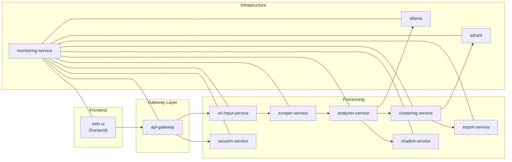

# Monitoring Service

## Overview
- Provides observability for the Tab Organizer platform: metrics, health monitoring, alerts, performance analysis, distributed tracing, and visualization endpoints.
- Built as a FastAPI application (`monitoring_service` package) with Prometheus instrumentation and integrations into Docker and the wider service mesh (`api-gateway`, `web-ui`, clustering pipeline, etc.).
- Main entrypoint `main.py` remains as a thin compatibility layer; all implementation lives under `monitoring_service/` for easier maintenance and testing.

## Architecture

## Package Layout
- `monitoring_service/app.py` – FastAPI factory and lifecycle wiring.
- `monitoring_service/core/` – component orchestration (`MonitoringComponents`) and shared helpers (`system.py`).
- `monitoring_service/metrics|health|alerts|performance|tracing/` – domain-specific subsystems.
- `monitoring_service/api/` – routed endpoints (`core.py`, `visualization.py`, dependencies, response models).
- `monitoring_service/instrumentation.py` – Prometheus metrics and request middleware.
- `monitoring_service/clients/docker.py` – Docker SDK bootstrap with safe fallbacks.
- `tests/` – unit and integration tests, updated to target the refactored package.

## Setup
- Ensure Python 3.10+ virtual environment is active.
- Install dependencies:
  - `pip install -r services/monitoring/requirements.txt`
- Optional: configure PostHog frontend tracking via the `web-ui` and provide relevant environment variables for the monitoring service to forward client metrics once implemented.

## Configuration
- Runtime settings derive from `MonitoringSettings` (`monitoring_service/config.py`).
- Key environment variables:
  - `LOG_LEVEL`, `LOG_FORMAT`, `LOG_FILE_PATH` – logging behaviour.
  - `METRICS_COLLECTION_INTERVAL`, `HEALTH_CHECK_INTERVAL`, `HEALTH_CHECK_TIMEOUT` – polling cadence.
  - `PERFORMANCE_TRACKING_ENABLED`, `DISTRIBUTED_TRACING_ENABLED` – toggle subsystems.
  - `WEBHOOK_URL`, `SLACK_WEBHOOK_URL`, `EMAIL_*` – alert notification channels.
  - `REDIS_URL`, `DOCKER_SOCKET` – infrastructure integrations.
- Service registry (`MonitoringSettings.services`) aligns with the clustering workflow and web UI expectations so cross-service calls (e.g., `/health`, `/metrics`) remain meaningful.

## Running & Testing
- Local run: `uvicorn services.monitoring.main:app --reload --port 8091`
- Run unit/integration tests (after installing dev requirements): `python -m pytest services/monitoring/tests`
- Smoke check metrics endpoint: `curl http://localhost:8091/metrics`
- Validate visualization flow for clustering insights: `curl http://localhost:8091/visualization/architecture/diagram`

## Development Tips
- Use `monitoring_service/app.create_app()` in tests or scripts when customising settings.
- Components can be accessed via `request.app.state.components` during runtime—see `api/dependencies.py` for helpers.
- When extending observability (e.g., PostHog or MCP integration), add new subsystems under `monitoring_service/<domain>/` and register background workers through `MonitoringComponents`.
- Keep Prometheus naming consistent; add new gauges/counters in `instrumentation.py` and update alerting thresholds in `MonitoringSettings`.

