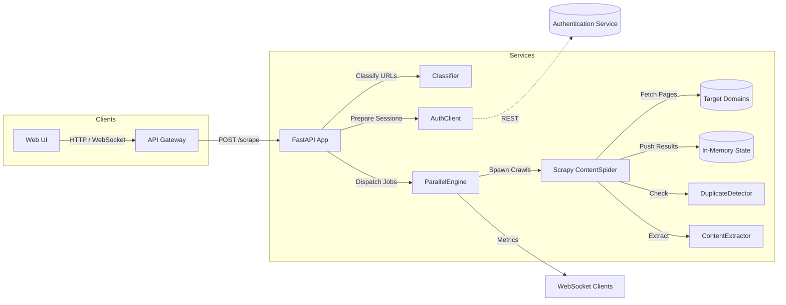

# Scraper Service

The scraper service orchestrates URL classification, authenticated crawling, content extraction, and duplicate detection for the Tab Organizer platform. It exposes a FastAPI application that coordinates Scrapy-based spiders, a parallel processing engine, and integrations with the authentication service and API gateway.

---

## Architecture Overview



- **FastAPI Application (`services.scraper.app`)**: Handles HTTP/WebSocket APIs, job state, and scheduling.
- **Parallel Processing Engine**: Maintains queues for public, authenticated, and retry URLs while coordinating async scraping tasks.
- **Scrapy `ContentSpider`**: Executes the actual fetches, integrates auth cookies/headers, and streams results back.
- **Content Pipeline**: Trafilatura and BeautifulSoup extract clean text; duplicate detection fingerprints content; robots compliance ensures respectful crawling.
- **Auth Integration**: `AuthenticationServiceClient` negotiates sessions with the auth service when protected endpoints are detected.

---

## Repository Layout

```
services/scraper/
├── app/                 # Service source code (FastAPI app, engines, utilities)
├── tests/               # Unit and integration tests
├── main.py              # Entry point & re-export layer for backwards compatibility
├── requirements.txt     # Service-specific dependencies
└── README.md            # You are here
```

Key modules:

- `app/api/routes.py` – FastAPI routes for job creation, metadata, stats, WebSocket updates.
- `app/processing.py` – Parallel processing engine and queue management.
- `app/spider.py` – Scrapy spider with auth injection, retry logic, and duplicate detection.
- `app/extraction.py` – Multi-strategy HTML/PDF/text extraction and quality scoring.
- `app/auth_client.py` – Client for the authentication microservice.

---

## Getting Started

### Prerequisites

- Python 3.12 (a `.venv` virtual environment is recommended).
- Service dependencies: `pip install -r services/scraper/requirements.txt`.
- Optional: Running auth/API gateway services for end-to-end testing (not required for unit tests).

### Running the Service Locally

```bash
cd /media/shoh/Shared/Shox/Projects/tab_organizer
source .venv/bin/activate
uvicorn services.scraper.main:app --reload --host 0.0.0.0 --port 8000
```

Useful endpoints once the server is running:

- `GET /health` – Service health & feature list.
- `POST /scrape` – Start a scraping job (expects `ScrapeRequest` payload).
- `GET /jobs/{job_id}` – Poll job state.
- `GET /jobs/{job_id}/urls` – Inspect per-URL metadata and classifications.
- `GET /stats` – Aggregate job and content metrics.
- `WS /ws/{job_id}` – Real-time job status streaming.

Configuration is provided through environment variables (via `pydantic-settings`). Key settings:

| Environment Variable        | Default                      | Purpose                                  |
|-----------------------------|------------------------------|------------------------------------------|
| `SCRAPER_AUTH_SERVICE_URL`  | `http://auth-service:8082`   | Base URL for the authentication service  |
| `SCRAPER_API_GATEWAY_URL`   | `http://api-gateway:8080`    | Optional API gateway endpoint            |
| `SCRAPER_USER_AGENT`        | `WebScrapingTool/1.0 ...`    | Default user agent for crawlers          |
| `SCRAPER_MAX_PARALLEL_WORKERS` | `5`                      | Worker pool size for parallel engine     |

---

## Testing

Run the full suite (unit + integration):

```bash
cd /media/shoh/Shared/Shox/Projects/tab_organizer
source .venv/bin/activate
python -m pytest services/scraper/tests
```

Targeted test runs:

- Unit tests only: `python -m pytest services/scraper/tests/unit`
- Integration tests only: `python -m pytest services/scraper/tests/integration`
- Verbose output: append `-vv`
- Coverage example: `python -m pytest --cov=services.scraper.app services/scraper/tests`

---

## Development Tips

- **State Awareness**: In production, replace the in-memory state (`app/state.py`) with Redis or a database for persistence and horizontal scaling.
- **Auth Simulation**: Integration tests mock the auth service—when interacting with the real service ensure the authentication microservice is running.
- **Extensibility**: New content extraction strategies can be added to `ContentExtractor.extraction_methods`; duplicate detection thresholds are configurable via `DuplicateDetector`.
- **Backwards Compatibility**: `services.scraper.main` re-exports legacy names so older tests & scripts that import from `main` continue to function.

---

## UI Integration Guide

> The web UI will be migrated after the service refactor. This section captures the contract the UI should adhere to once it switches over.

### Base Path (via API Gateway)

- `POST /api/scraper-service/scrape` – canonical job creation endpoint.
- `POST /api/scraper-service/classify-urls` – classify URLs before dispatch (optional helper).
- `GET  /api/scraper-service/jobs` – list active job identifiers.
- `GET  /api/scraper-service/jobs/{jobId}` – retrieve the full `ScrapeJob` document.
- `GET  /api/scraper-service/jobs/{jobId}/realtime-status` – structured snapshot of live progress.
- `DELETE /api/scraper-service/jobs/{jobId}` – cancel a job.
- `WS   /api/scraper-service/ws/{jobId}` – streaming progress updates for dashboards.
- `GET  /api/scraper-service/stats` – aggregate metrics for reporting widgets.

### Request/Response Cheat Sheet

**Create job** (`ScrapeRequest`):
```json
POST /api/scraper-service/scrape
{
  "session_id": "session-123",
  "urls": [
    {
      "url": "https://example.com",
      "priority": 1,
      "metadata": {"tag": "news"}
    }
  ],
  "parallel_auth": true,
  "respect_robots": true
}
```

Response:
```json
{
  "job_id": "job_1728461000_0",
  "status": "started",
  "message": "Processing 1 URLs with parallel authentication workflow",
  "correlation_id": "api_1ab23c45",
  "url_classifications": [...],
  "processing_stats": {...},
  "websocket_url": "/ws/job_1728461000_0"
}
```

To list jobs call `GET /api/scraper-service/jobs`; it returns a JSON array of job IDs (e.g. `["job_1728461000_0", "job_..."]`).

To inspect an individual job call `GET /api/scraper-service/jobs/{jobId}`; the response is the full `ScrapeJob` document defined in `services/scraper/app/models.py` (including classifications, results, errors, and processing stats).

**Real-time updates**: connect to `WS /api/scraper-service/ws/{jobId}` for push notifications; payloads conform to `RealTimeStatus`.

### Front-end Notes

- Always provide `session_id`; downstream pipeline (clustering, session service) uses it to group content.
- Use `/scrape` to enqueue work; client-side batching should build the `urls` array directly rather than relying on service-side wrappers.
- To cancel jobs, issue `DELETE /api/scraper-service/jobs/{jobId}`.
- Respect the rate/timing options exposed in `ScrapeRequest` when providing UI controls (max concurrent workers, delays, `respect_robots` switch, etc.).
- After migration the UI should stop relying on service-internal URLs such as `/jobs/{jobId}/urls` and instead stick to the REST surface documented here.

Feel free to expand this README with deployment specifics or service-level observability notes as the scraper evolves. Happy crawling!
