# Session Management Service

This service provides persistent session lifecycle management for the Tab Organizer platform.  
Each session captures workspace metadata, processing statistics, Qdrant collection bindings, and collaboration settings so downstream services (ingestion, analysis, clustering, export, chatbot) can keep data isolated per user project.

---

## Capabilities

- Create, list, update, archive, restore, share, and delete sessions.
- Merge multiple sessions into a new consolidated workspace or split a session into focused subsets.
- Provision and manage the dedicated Qdrant collection that stores vectors for a session.
- Track processing statistics (URLs processed, embeddings created, clustering runs) and model usage history.
- Import/export a session together with its Qdrant payload for backup or migration.
- Enforce retention policies (auto-archive/auto-delete) and expose collaborator metadata.

---

## High-Level Architecture

```mermaid
flowchart TD
    subgraph Session_Service
        API[FastAPI Router] --> ServiceLogic[SessionService]
        ServiceLogic --> Repo["SessionRepository (in-memory)"]
        ServiceLogic --> QdrantClient[SessionVectorStore → Qdrant]
    end

    Client["API Gateway / other services"] --> API
    ServiceLogic <--> SessionStore["Session metadata (in-memory dict)"]
    QdrantClient --> QdrantDB[(Qdrant Collections per Session)]
```



Key data flow:
1. Clients call REST endpoints through the FastAPI router (`app/api/routes.py`).
2. The router delegates to the `SessionService` business logic layer.
3. Session data lives in the in-memory `SessionRepository` (production deployment can swap in persistent storage).
4. Vector payloads are created/dropped via the `SessionVectorStore`, which wraps the Qdrant client.

---

## Project Layout

```
services/session
├── app
│   ├── api/          # FastAPI routes and dependency wiring
│   ├── logging.py    # Structlog configuration
│   ├── models.py     # Pydantic models and enums
│   ├── qdrant.py     # Qdrant client utilities
│   ├── services.py   # Session business logic
│   └── storage.py    # In-memory repository abstraction
├── tests/            # Unit and integration tests
└── main.py           # Uvicorn entrypoint and compatibility exports
```

---

## Running the Service

1. **Install dependencies**
   ```bash
   pip install -r services/session/requirements.txt
   ```

2. **Set environment variables (optional)**
   ```bash
   export QDRANT_HOST=localhost        # defaults to qdrant
   export QDRANT_PORT=6333             # defaults to 6333
   ```

3. **Start the API with Uvicorn**
   ```bash
   uvicorn services.session.main:app --reload --port 8087
   ```

   The service will be available at <http://localhost:8087>. OpenAPI docs live at `/docs`.

---

## Testing

The test suite uses `pytest` and mocks Qdrant by default.

```bash
PYTHONPATH=services/session pytest services/session/tests -q
```

Add `-k pattern` or `-vv` for targeted or verbose runs.

---

## API Overview

**Lifecycle**
- `POST /sessions` – create a new session (and Qdrant collection).
- `GET /sessions` – list sessions with optional filters (`status`, `owner_id`, `tags`).
- `GET /sessions/{id}` – fetch session details.
- `PUT /sessions/{id}` – update metadata, configuration, tags.
- `DELETE /sessions/{id}` – soft-delete unless `?permanent=true`.
- `POST /sessions/{id}/archive` / `/restore` – change lifecycle state.
- `POST /sessions/merge` – merge multiple sessions into a new one (optionally archiving the sources).
- `POST /sessions/{id}/split` – carve a session into new sessions based on supplied Qdrant point IDs.

**Collaboration**
- `POST /sessions/{id}/share` – share with additional users.
- `DELETE /sessions/{id}/share/{user_id}` – revoke access.
- `GET /sessions/{id}/collaborators` – view collaborators.

**Statistics & Retention**
- `PUT /sessions/{id}/stats` – increment processing counters via downstream services.
- `PUT /sessions/{id}/model-usage` – track LLM/embedding model usage.
- `POST /sessions/cleanup` – run retention policy rules.
- `GET/PUT /sessions/retention-policy` – inspect or update defaults.

**Import/Export**
- `GET /sessions/{id}/export` – export session metadata and optional Qdrant data.
- `POST /sessions/import` – rehydrate a session, optionally renaming it.

Refer to the router definitions in `app/api/routes.py` for the full set of endpoints and parameters.

---

## UI Integration Guide

> The UI will be refreshed after the backend refactor. The bullets below capture the surface that the front end should target once it migrates.

### Base Path (via API Gateway)

- `POST /api/session-service/sessions` – create a workspace (returns `SessionModel`).
- `GET  /api/session-service/sessions` – list sessions with optional filters (`status`, `owner_id`, `tags`).
- `GET  /api/session-service/sessions/{sessionId}` – fetch full metadata for detail panes.
- `PUT  /api/session-service/sessions/{sessionId}` – update name, description, tags, retention settings.
- `DELETE /api/session-service/sessions/{sessionId}` – delete (supports `?permanent=true`).
- `POST /api/session-service/sessions/{sessionId}/archive` / `/restore` – lifecycle transitions.
- `POST /api/session-service/sessions/{sessionId}/share` / `DELETE .../share/{userId}` – manage collaborators.
- `GET  /api/session-service/sessions/{sessionId}/collaborators` – fetch sharing info for UI tables.
- `POST /api/session-service/sessions/compare` – compare sessions by ID list.
- `POST /api/session-service/sessions/merge` / `POST /api/session-service/sessions/{sessionId}/split` – advanced operations for bulk management.
- `PUT  /api/session-service/sessions/{sessionId}/stats` & `PUT /api/session-service/sessions/{sessionId}/model-usage` – downstream services should continue to call these when updating dashboard counters; the UI may display their output.

### Sample UI Flow

1. **List sessions:** call `GET /api/session-service/sessions`; the response is a list of `SessionModel` objects that can feed tables or dropdown selectors.
2. **Show details:** call `GET /api/session-service/sessions/{sessionId}` when a user selects a session; display metadata, counters, retention policy, and collaborator data.
3. **Archive/restore:** POST to `/archive` or `/restore` and refresh the list.
4. **Share management:** use the share endpoints to present add/remove collaborator dialogs.

### Front-end Notes

- Always pass identifiers exactly as returned in `SessionModel.id` (they are used downstream by ingestion, clustering, and export).
- Extended operations (`merge`, `split`, `export`, `import`) are optional enhancements; the UI can surface them as advanced actions.
- When deleting sessions, consider prompting for permanent deletion because `DELETE` defaults to soft-delete.
- The stats/model usage endpoints are designed for automation, but exposing their output in dashboards can help users track activity.

---

## Integration Notes

- Downstream services should associate work with a `session_id`. The URL ingestion service, clustering engine, analyzer, chatbot, and exporter all call the Session service to fetch metadata, update stats, or confirm Qdrant collection availability.
- When adding new long-running workflows, call `PUT /sessions/{session_id}/stats` to keep the dashboard counters accurate.
- For deployments where the in-memory repository is insufficient, replace `SessionRepository` with a persistent implementation (e.g., Redis or a relational DB) and wire it in inside `app/__init__.py`.
- Merging/splitting relies on Qdrant point identifiers. Ensure upstream pipelines capture and persist point IDs if you plan to split sessions through the API or UI.

---

## Troubleshooting

- **`ModuleNotFoundError: app` when starting Uvicorn**  
  Ensure you launch the app via the package path (`uvicorn services.session.main:app`). Running `python main.py` also works because the entrypoint adjusts `sys.path` for script mode.

- **Qdrant connection issues**  
  Confirm the Qdrant instance is reachable at `QDRANT_HOST:QDRANT_PORT`. In development, you can comment out Qdrant calls or mock `SessionVectorStore`.

- **Missing session stats updates**  
  Downstream services must include `session_id` when invoking stats/model endpoints. Review service logs for warnings about failed stats updates.

---

Happy hacking! 🎯
