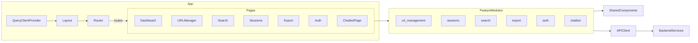

# Web UI Service

## Overview

The Web UI is a React application that orchestrates URL ingestion, content exploration, clustering analysis, authentication workflows, and export operations for the broader tab_organizer platform. It relies on a set of backend microservices that expose REST APIs. The UI is organised into focused feature modules to keep the codebase maintainable and easy to evolve.

## Architecture



### Key Directories

```
services/web-ui/src
├── components/               # Cross-feature UI widgets (e.g. Layout, Chatbot shell)
├── features/                 # Feature-specific hooks and components
│   ├── auth/
│   ├── chatbot/
│   ├── export/
│   ├── search/
│   ├── sessions/
│   └── url-management/
├── lib/
│   └── api/                  # Axios client + typed service modules
├── pages/                    # Route-level containers that orchestrate features
└── shared/                   # Reusable UI primitives and utilities
```

### API Modules

The API client lives in `src/lib/api`. Each backend service has its own module (e.g. `sessions.js`, `search.js`). All modules share the configured Axios client (`client.js`) that injects authentication headers and handles error propagation.

## Setup

```bash
cd services/web-ui
npm install
# Start the dev server (proxy configured in package.json)
npm start
```

The development server proxies API calls to `http://api-gateway:8080` by default. To work against a different gateway, set `REACT_APP_API_URL` in `.env`.

Helper scripts now live under `services/web-ui/scripts`. For example:

```bash
# run the quick unit-test loop
./scripts/test_quick.sh

# build and execute tests inside Docker
./scripts/test-docker.sh
```

## Configuration

Environment variables are consumed via `process.env.REACT_APP_*`. Common options:

- `REACT_APP_API_URL` – Base URL for the API gateway (defaults to `http://localhost:8080`).
- `REACT_APP_POSTHOG_TOKEN`, `REACT_APP_POSTHOG_HOST` (optional) – Enable PostHog analytics if required.

## Testing

```bash
cd services/web-ui
npm test -- --watchAll=false
```

The Jest suite exercises critical pages (Search, URL Manager, Chatbot) and mocks backend services via the new `lib/api` modules.

## Development Tips

- **Feature-first organisation**: Keep page components lean. Place reusable view logic or hooks under `src/features/<feature-name>`.
- **React Query**: All remote data access is powered by React Query. Prefer colocated hooks (e.g. `useSessionsManager`) that encapsulate fetch/mutation behaviour.
- **Shared utilities**: Cross-cutting helpers, such as `getErrorMessage`, live under `src/shared`. Reuse them to keep error handling consistent.
- **Styling**: Tailwind-style utility classes are used throughout. New components should follow the existing patterns for spacing and typography.
- **API contracts**: Reuse the typed service modules instead of scattering `axios` calls. This keeps service connections auditable and simplifies future gateway changes.

## Service Integrations

The UI communicates with backend microservices through the following modules:

| Module                          | Endpoint namespace                  | Primary Responsibilities                         |
|---------------------------------|-------------------------------------|--------------------------------------------------|
| `src/lib/api/url.js`           | `/api/input`                        | URL ingestion, metadata management               |
| `src/lib/api/scraping.js`      | `/api/scraper-service`              | Triggering and monitoring scrapes                |
| `src/lib/api/search.js`        | `/api/analyzer-service`             | Semantic/keyword search                          |
| `src/lib/api/sessions.js`      | `/api/session-service`              | Session CRUD, merge, compare, split              |
| `src/lib/api/exportService.js` | `/api/export-service`               | Export job management and template discovery     |
| `src/lib/api/auth.js`          | `/api/auth`                         | Credential storage, interactive auth, sessions   |
| `src/lib/api/chatbot.js`       | `/api/chatbot-service`              | Conversational assistant interactions            |

These modules expose Promise-based helpers that are consumed by feature hooks, allowing each page to focus on state orchestration instead of request wiring.
